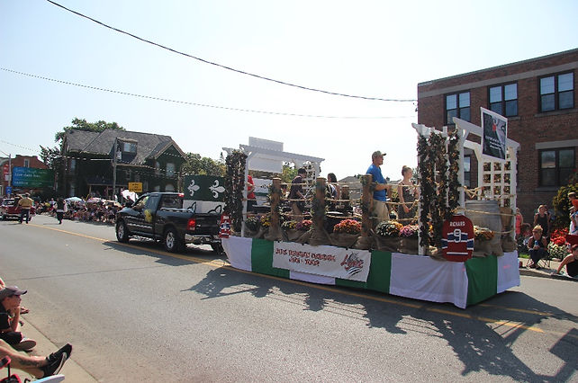
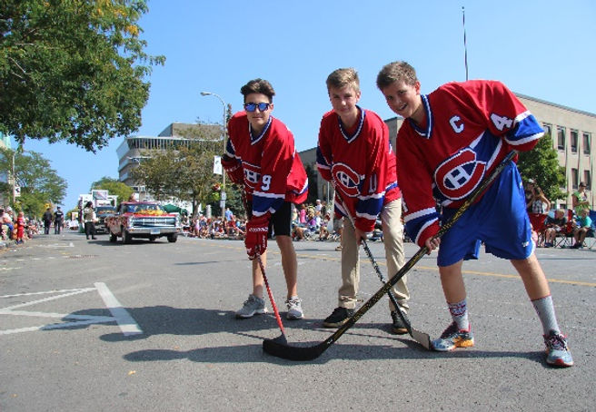
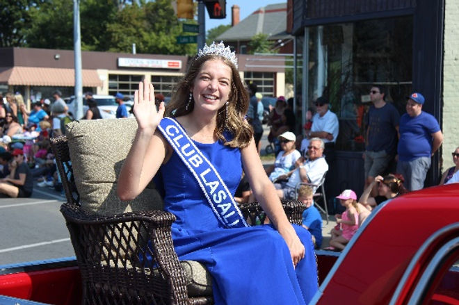

La communauté Franco-Ontarienne a affiché ses couleurs à la Grande Parade du festival du vin et du raisin le samedi 23 septembre dernier.  Le char allégorique préparé par les bénévoles du Griffon et des élèves de l’école Jean-Vanier mettait en vedette des légendes canadiennes françaises dans le cadre du thème de la parade, « Canada 150 : Strong, Proud and Free. ».

Ainsi, trois élèves portaient avec beaucoup de fierté, les gilets des grandes vedettes, Maurice Richard, Jean Béliveau et Guy Lafleur.  Nos jeunes hockeyeurs se sont assurés d’entretenir la foule surtout lorsque des partisans des Leafs leurs donnaient du fil à retorde.  Parmi les légendes représentées figuraient Samuel de Champlain et le légendaire Joseph Montferrand. L’orchestre de Jean-Vanier a également présenté un répertoire de chansons populaires au grand plaisir de la foule estimée à plus de 50 000 participants.

Finalement, l’ambassadrice du Club La Salle, Milana Thibodeau-Morris accompagnait le cortège francophone assise à l’arrière de la Ford Ranchero 1950 d’un rouge éclatant de M. Bernard Leblanc.

D’année en année, Le Griffon s’assure de préparer un char allégorique en collaboration avec le Cub La Salle et les élèves pour souligner la vitalité de la communauté francophone de Niagara.