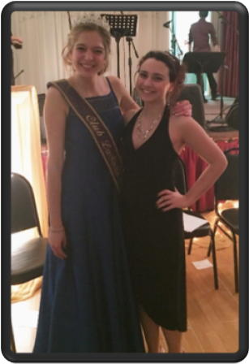

Les bénévoles du Griffon en collaboration avec le Club La Salle ont déjà entrepris les préparatifs du grand gala de l’ambassadeur/ambassadrice de la communauté francophone du Niagara qui aura lieu au Club La Salle le samedi 21 avril 2018. La soirée sera animée par des élèves de Jean-Vanier. L’an passé, 8 excellentes candidates se sont présentées pour porter la couronne de l’ambassadrice des francophones de Niagara. Milana Thibodeau-Morris en fut la récipiendaire.

[Milana Thibodeau-Morris, ambassadrice 2017 accompagnée de Danika Girouard, l’ambassadrice 2016]

Vous pouvez vous procurer un billet au coût de 20 $ en communiquant avec Mme Julie Rioux à l’école Jean-Vanier au 905-714-7882. Un souper gastronomique sera servi. Soyez des nôtres pour ce gala qui met en vedette des petites perles de chez nous.

