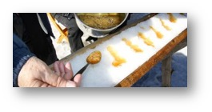
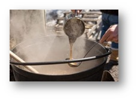
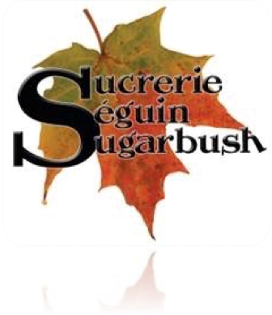

Le Centre communautaire le Griffon vous invite à sa Cabane à sucre au Club La Salle, le dimanche 3 mars de 12 h à 17 h. Un déjeuner sera servi à compter de 12 h incluant des œufs, du jambon, des saucisses, des fèves au lard, de la tourtière, des patates au four, des crêpes françaises et comme de raison, du sirop d’érable.

La cuisine sera ouverte toute la journée. On offrira de le pouding au chômeur comme dessert. Nous offrirons également de la tire sur de la neige en après-midi. Il y aura un spectacle musical de 13 h 30 à 17 h.

Venez passer un bel après-midi au Club La Salle dans la grande tradition de la Cabane à sucre canadienne française. Nous mettons en vedette le sirop d’érable de l’érablière Séguin de Monetville.

Sucriers de 4e génération, Daniel et Tracy Séguin, ainsi que Louise (Séguin) et Michel Demers, poursuivent la tradition annuelle du printemps en transformant la sève sucrée en sirop d’érable sur un évaporateur à bois à haute efficacité.

« Au fil des années, le sirop d’érable et les produits de la Sucrerie Séguin Sugarbush ont gagné plusieurs prix. Aussi, notre sirop a été utilisé pour la confection de sucre comme cadeau souvenir canadien aux participants et à des invités aux Jeux panaméricains et parapanaméricains de 2015 à Toronto. Nous sommes honorés d’être déclarés Champions du monde à la Foire royale d’hiver agricole 2016. Cependant, notre ultime couronnement est de voir les sourires et d’entendre les bons commentaires de nos fidèles clients qui viennent déguster nos produits d’érables à chaque année. »

Au plaisir de vous retrouver en grands nombres le 3 mars au Club La Salle