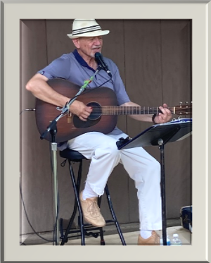

Après cette longue période de pandémie, les gens étaient ravis de pouvoir se rencontrer pour un concert et BBQ communautaire. En respectant les mesures de distancements ainsi que le port d’un masque, les gens ont pu jouir d’un concert présenté par Gilles Groleau, un artiste bien connu dans la communauté francophone du Niagara.  Il s’agissait d’une rencontre bien appréciée sous un beau soleil d’été.

De plus, Jean-Marc Robert a ajouté au spectacle en interprétant quelques morceaux bien connus à l’harmonica. Tous les participants ont partagé leur désir de se revoir prochainement pour un autre événement de ce genre puisqu’il est tellement plaisant de pouvoir se rencontrer entre amis!

