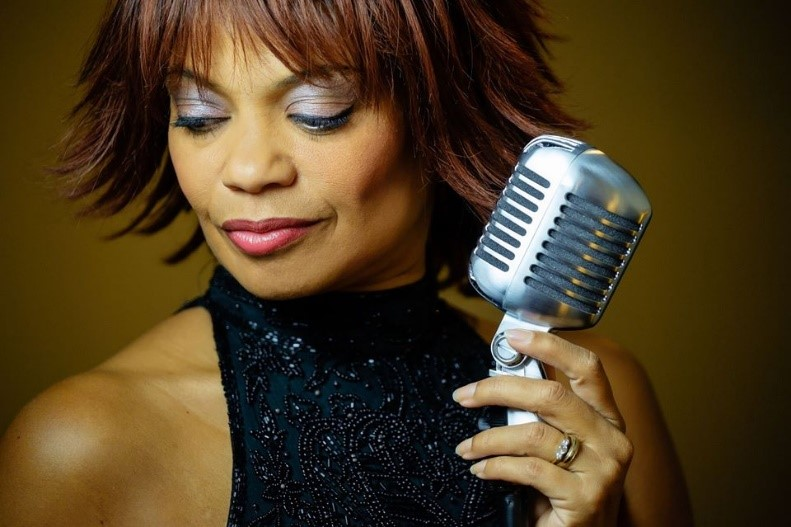
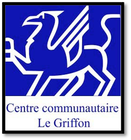

import Patrimoine from "../../../../components/Patriomoine";

Le Griffon vous invite à une soirée de jazz mettant en vedette le quintet de ***Juliet Dunn*** au Centre Immaculée au 101 rue Garnet le dimanche 28 novembre de 17h à 20h30.

Charcuteries à l’accueil en plus de services d’apéritifs aux 2 entractes.

<em>Une soirée à ne pas manquer dans l’atmosphère d’un café parisien</em>

Billets 20$

Bar payante, vin et bière

Le Club des Bons Vivants

Jean Chartrand 905-685-2984

Le Griffon est tenu de respecter les mesures préventives de la Covid 19

<Patrimoine />