import {Carousel} from "react-bootstrap";

<Carousel className="mb-5 bg-dark">
<Carousel.Item>

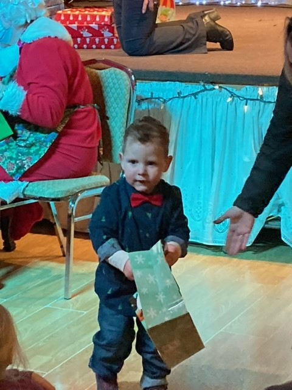

</Carousel.Item>
<Carousel.Item>

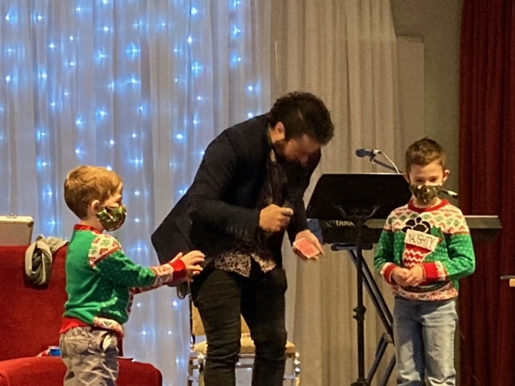

</Carousel.Item>
<Carousel.Item>

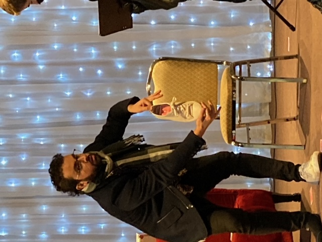

</Carousel.Item>
<Carousel.Item>

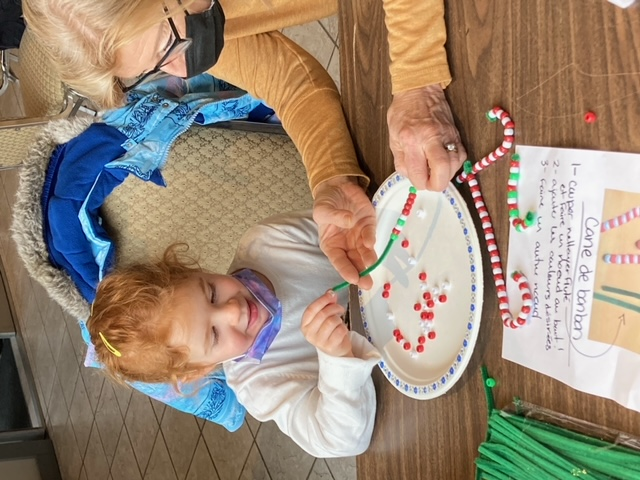

</Carousel.Item>
<Carousel.Item>

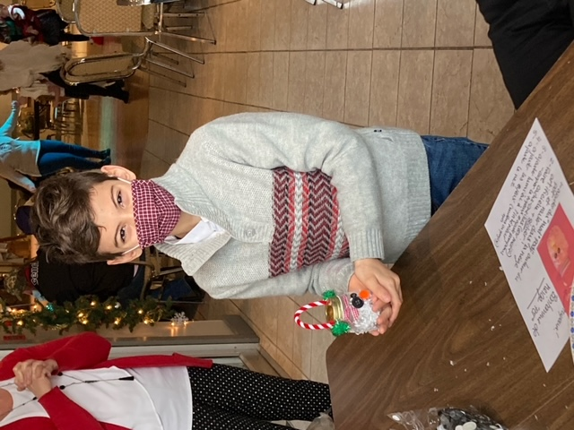

</Carousel.Item>
<Carousel.Item>

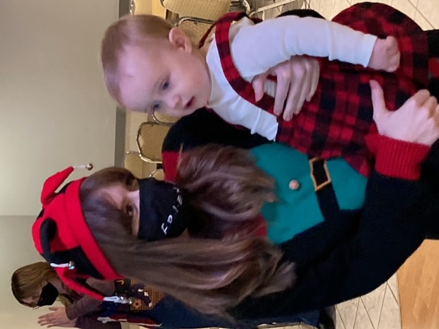

</Carousel.Item>
<Carousel.Item>

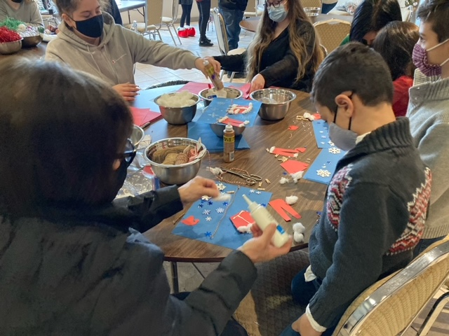

</Carousel.Item>
<Carousel.Item>

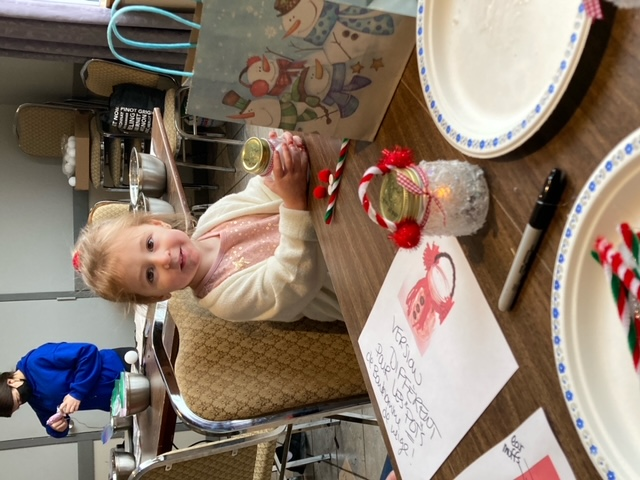

</Carousel.Item>
</Carousel>

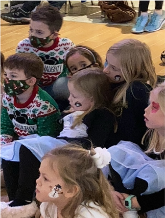

Les bénévoles du Griffon animaient pour une vingt-deuxième année consécutive, le Noël des petits au Club La Salle le 5 décembre dernier. Les gens ont joui de cet après-midi qui s’est déroulée dans une ambiance familiale. Dès leur arrivée, les soixante petits qui participaient ont confectionné de jolis bricolages de Noël sous la direction de 8 élèves de l’école secondaire St. Jean de Brébeuf. Dans l’arrière-plan, Suzanah Taylor interprétait un répertoire de chant de Noël pour les gens de tout âge par son grand talent de vocaliste. Les petits ont été fort éblouis par le spectacle de magie de Marc Anthony qui les a émerveillés avec des trucs de jeux de carte. Les parents et grands-parents se sont joints à la comédie.

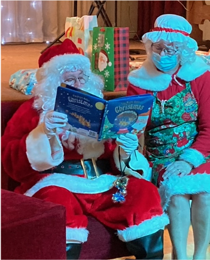

Vers quinze heures Suzanah a rassemblé la foule d’enfants en chantant, « Voici le Père Noël » pour qu’ils accueillent Mère Noël et Père Noël. Attentifs à chaque geste de leurs hôtes, ils se sont assis près de Mère et de Père Noël pour écouter sans manquer un mot, une histoire de la veille de Noël. Tour à tour les petits sont allés visiter le couple à l’honneur pour recevoir un joli cadeau. « Soyez de bons enfants, car le Père Noël est toujours à l’écoute et passez une vacance familiale remplie de joie et de partage, » fut le message d’adieu du Père Noël. Et cela résume une autre journée spéciale au domaine des francophones de Niagara !

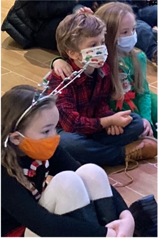

Le Griffon s’engage à vous offrir une gamme de spectacle de qualité dans les mois à venir. Tenez-vous au courant à partir de notre site web ou de notre page Facebook.
