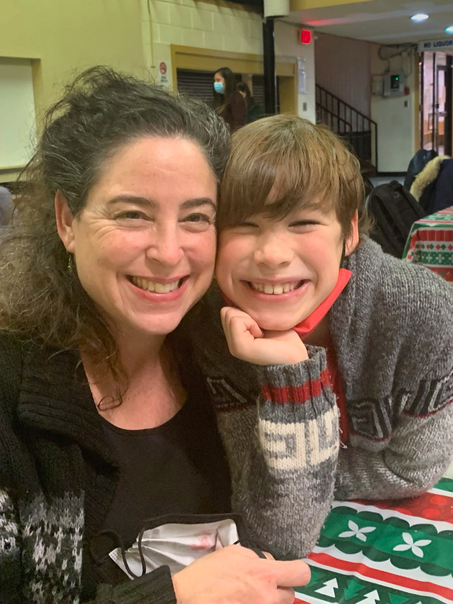

import {Carousel} from "react-bootstrap";

Le souper communautaire au spaghetti du 14 décembre a donné l’occasion à plusieurs familles de jouir d’un spectacle de Noël en personne en plus de déguster un bon souper. Dès 17 heures, ils s’agissaient des retrouvailles pour une trentaine de familles, évidemment, en suivant les protocoles sécuritaires de la Covid-19. Pour éviter la circulation, le repas fut servi aux tables. Salade du jardin, pâte penne avec sauce maison, un petit pain, un breuvage et un dessert, il ‘agissait d’une gastronomie à prix modique ! En effet, les élèves du cours d’hôtellerie ont préparé une sauce magnifique sous la direction de M. Marquis Charrette. Tout au long de la soirée les gens ont joui d’un spectacle qui mettait à l’affiche quelques artistes de l’école St. Jean-de-Brébeuf en plus de Suzanah Taylor. Comme pièce de résistance, les gens ont pu visionner un concert de Noël virtuel mettant en vedette les élèves de l’école Immaculée Conception. Bien que la soirée fut d’une durée de deux heures trente minutes, les familles présentes ont profité d’une rencontre traditionnelle du temps des fêtes courtoisie du Griffon.

<Carousel className="mb-5 bg-black">
<Carousel.Item>

</Carousel.Item>
<Carousel.Item>

</Carousel.Item>
<Carousel.Item>

</Carousel.Item>
<Carousel.Item>

</Carousel.Item>
<Carousel.Item>

</Carousel.Item>
<Carousel.Item>

</Carousel.Item>
<Carousel.Item>

</Carousel.Item>
<Carousel.Item>

</Carousel.Item>
<Carousel.Item>

</Carousel.Item>
<Carousel.Item>

</Carousel.Item>
</Carousel>
