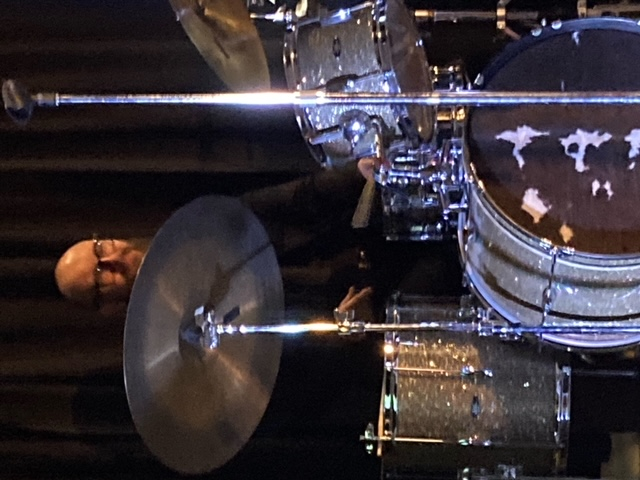

import {Carousel} from "react-bootstrap";

<Carousel className="mb-5">
<Carousel.Item>

</Carousel.Item>
<Carousel.Item>

</Carousel.Item>
<Carousel.Item>

</Carousel.Item>
<Carousel.Item>

</Carousel.Item>
<Carousel.Item>

</Carousel.Item>
<Carousel.Item>

</Carousel.Item>
<Carousel.Item>

</Carousel.Item>
</Carousel>

Juliet Dunn et le Trio Parisien sont devenus des vedettes pour la communauté francophone de Niagara dès leur entrée en scène. La soirée thématique prenait l’ambiance d’un Café Parisien à partir des décors et du menu qui comprenait des charcuteries, des hors d’œuvres en plus d’une variété d’amuse-gueules qui ont fait saliver les palets les plus capricieux. Les gens étaient évidemment dans l’ambiance. De dire plusieurs participants, « Il faut prendre part à des soirées de ce genre plus souvent, ce spectacle m’a transporté pendant ces quelques heures au théâtre parisien. »

Il s’agissait en effet d’une performance durant laquelle la chanteuse et les musiciens étaient au sommet de leur art. Les gens ont facilement reconnu de nombreux morceaux dont ; Sur les quais du vieux Paris ; C’est si bon ; J’ai deux amours et La vie en rose pour en énumérer quelques-uns. En effet, la passion de Juliet pour le jazz fut transparente tout au long du spectacle sans négliger de souligner le grand talent de Peter Shea au piano à qui l’on doit remettre trois palmes. Pour résumer l’expérience des gens, je cite une participante qui a proclamé, « Ce fut tellement plaisant de pouvoir sortir et de jouir d’une soirée réalisée avec goût, comme je me suis amusée ! »

Le Griffon s’engage à vous offrir une gamme de spectacle de qualité dans les mois à venir. Tenez-vous au courant à partir de notre site web ou de notre page Facebook.
