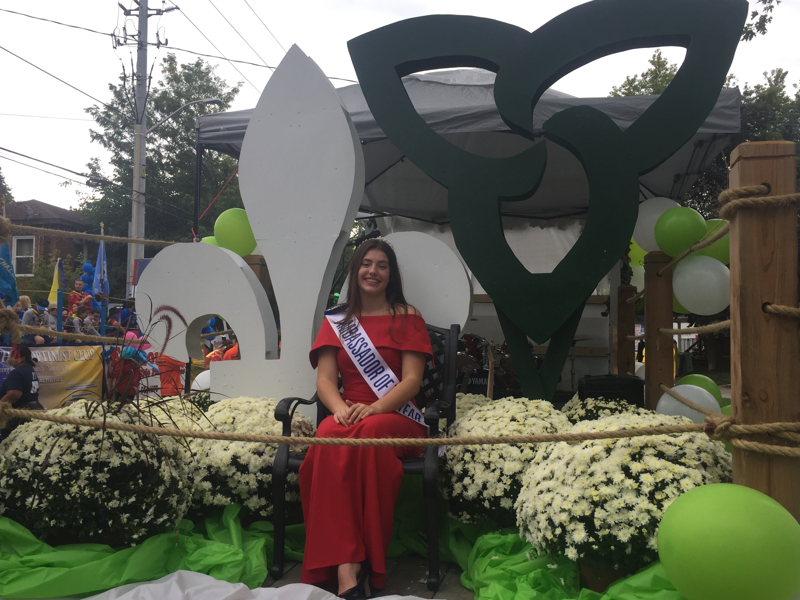

import Patrimoine from "../../../../components/Patriomoine";

## Le samedi 5 mars 2022
**Club La Salle, 111 rue Arthur, St Catharines**

- Cocktails à 17h30
- Souper à 18h

### Billets
- Adultes: 20$
- Étudiants: 15$

_Veuillez confirmer votre présence en acheminant l’argent pour vos billets à l'école Saint-Jean-de-Brébeuf, ou **Jean Chartrand au 905-685-2984**_

_Par respect pour les mesures sécuritaires de la COVID, nous sommes tenus à une foule de 70 personnes. Les billets sont réservés pour les candidates, leurs familles et leurs amis._

<Patrimoine />

