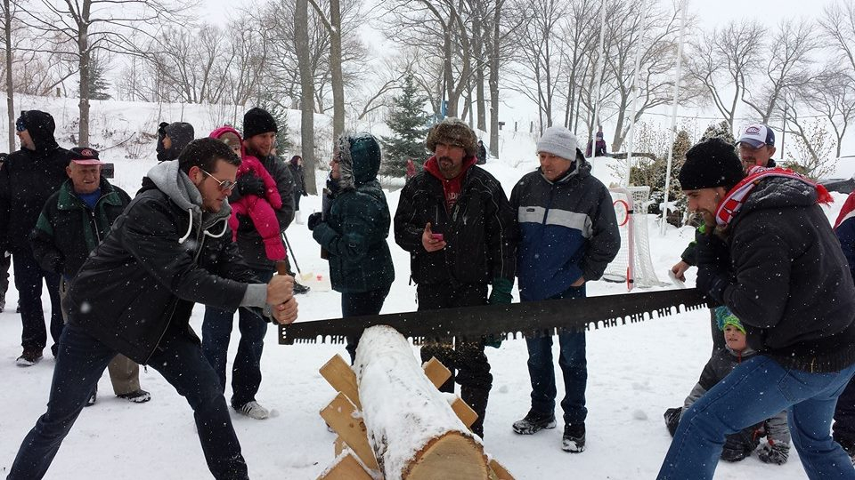
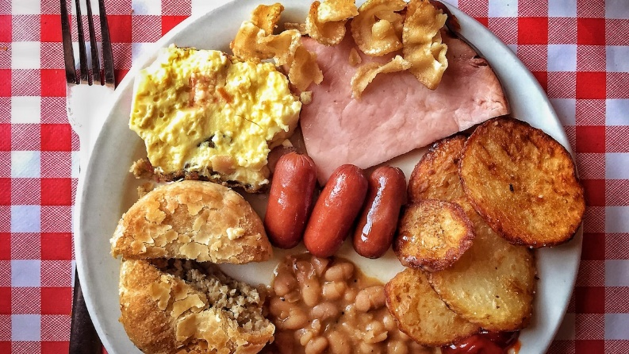

Dans la grande tradition des érablières du nord ontarien, les bénévoles du Griffon accueillaient une foule de 160 convives à son déjeuner cabane à sucre qui avait lieu le samedi 12 mars au Club La Salle. Fidèle aux traditions des érablières franco-ontariennes, on offrait aux gens un déjeuner canadien français y compris les œufs brouillés, les fèves au lard, du jambon, des saucisses, des rôtis, des petites patates grillées et une pointe de tourtière. « On a mangé comme des ours », proclamèrent la plupart des participants. « Le déjeuner fut excellent ! » Il est à souligner que la tourtière, recette de Monetville ainsi que les fèves au lard étaient les pièces de résistance de ce repas des gens de chez nous. Comme gâterie pour les gens au bec sucré, il y avait de la tire sur de la neige par Vic Pépin et Michel Cayouette préparé avec le bon sirop de l’érablière Séguin de la région de Lavigne. En effet, à la cabane, on ne fait pas que se régaler de petites douceurs, on célèbre l’érable dans toute sa splendeur ! Au Club samedi dernier, il s’agissait d’une fête dans toute la splendeur de notre patrimoine franco-ontarienne, c’était le temps des sucres.

Cependant, un repas de cabane à sucre sans musique, c’est comme des crêpes sans sirop. Gilles Groleau, un artiste de la région qui joue de la musique au Club depuis l’âge de 15 ans, a interprété durant le déjeuner, un répertoire de chants du palmarès canadiens français depuis les années 60. Les gens l’ont applaudi à maintes reprises.

Pour clore la journée, Normand Meilleur et Chantal Martin, deux artistes de la région de Montréal, ont présenté un spectacle qui mettait en vedette les plus grands succès de Ginette Reno et de Claude Dubois. L’audience comprenant des petits jusqu’à nos cerbères de l’âge d’or ont suivi le spectacle avec joie et émotions.

La journée fut un grand succès à tous les niveaux grâce aux bénévoles du Griffon et nos partenaires du Club La Salle. Il s’agissait d’un groupe d’une vingtaine de bénévoles qui ont travaillé ensemble pour réaliser cette tradition canadienne française. Il est à souligner que les activités rassembleuses du Griffon ne pourraient avoir lieu sans le financement du Patrimoine Canadien.

Veuillez consulter notre site web ainsi que notre page Facebook pour les activités à venir.
