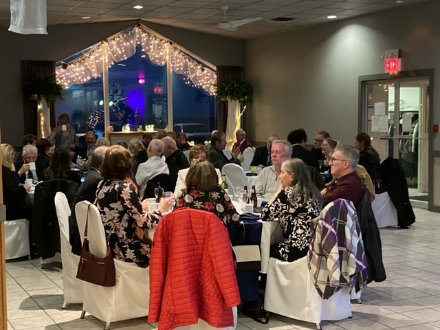
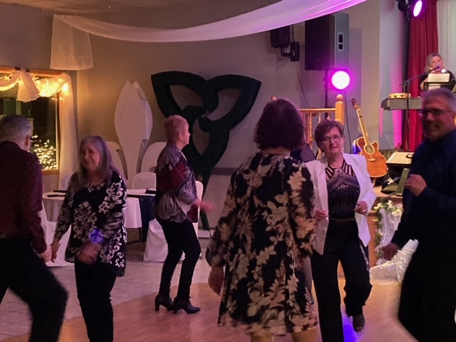

import {Carousel} from "react-bootstrap";

<Carousel className="mb-5 bg-black">
<Carousel.Item>

</Carousel.Item>
<Carousel.Item>

</Carousel.Item>
<Carousel.Item>

</Carousel.Item>
<Carousel.Item>

</Carousel.Item>
<Carousel.Item>

</Carousel.Item>
</Carousel>

La célébration de la veille du jour de l’an reportée, la fête de la St. Valentin remis à une date ultérieure, la communauté du Club La Salle se réjouissait de pouvoir finalement se rencontrer au gala du printemps ! Pour cet événement tellement attendu, le Club fut transformé dans une salle digne d’un festin royal. Colonnes décorées, arrangements de fleurs sur chaque table, jeux de tissus suspendus au plafond en cascades, la salle était de toute beauté ! Les gens étaient heureux ! Un souper gastronomique à sept services préparé par la cuisinière Micheline Hervé-Beleau était de mise pour ce grand rassemblement. De dire le président du Club, « on a mangé comme des rois. » Que serait une rencontre canadienne-française sans une soirée dansante. Comme ils le faisaient dans les années 70, le groupe Talisman maintenant un peu grisonné a entraîné les gens au plancher de danse. Ce fut le point culminant d’une soirée parfaite. Les bénévoles du Griffon étaient heureux d’appuyer le Club dans cette soirée bien apprécié par les convives de notre domaine francophone. Les bénévoles du Griffon tiennent à remercier le Patrimoine Canadien pour son appui financier qui nous permet de réaliser ces grands événements.