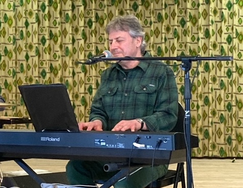
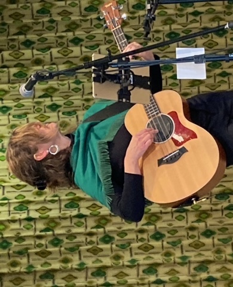

import {Carousel} from "react-bootstrap";

<Carousel className="mb-5 bg-black">
<Carousel.Item>

</Carousel.Item>
<Carousel.Item>

</Carousel.Item>
<Carousel.Item>

</Carousel.Item>
<Carousel.Item>

</Carousel.Item>
<Carousel.Item>

</Carousel.Item>
<Carousel.Item>

</Carousel.Item>
<Carousel.Item>

</Carousel.Item>
<Carousel.Item>

</Carousel.Item>
</Carousel>

Le dimanche 20 mars, le Club Renaissance de Welland avec l’appui du Griffon accueillait le Groupe ARIKO de Lafontaine dans le cadre de la célébration de la St. Patrice. Il s’agissait du premier rassemblement de cette communauté depuis 2 ans en raison de la pandémie. La foule comprenait des gens des quatre coins de la péninsule. « Comme il fait bon de se rencontrer en famille après avoir été encabané pendant deux années!» proclamait Muriel Thibault-Gauthier, la coordonnatrice de l’activité. On pouvait ressentir l’énergie au sein de cette foule, fier de faire les retrouvailles après cette longue période d’isolement. L’esprit était à la fête. Suite à un bon dîner servi dans le cadre de la St. Patrice, on introduit ARIKO. Dès le premier morceau, la troupe a soulevé la foule, le party a pris feu ! Les violons fougueux des deux sœurs accompagnés de leurs parents au piano et à la basse ont produit une énergie électrisante. Le répertoire comprenait des pièces du folklore canadien-français, des chansons traditionnelles au violon et de la danse à claquette. Fidèle au thème de la journée, la troupe a engagé la foule en intégrant des morceaux Irlandais et même Cajun. Moi j’viens du Nord, ARIKO, Danny Boy figuraient parmi les morceaux qui ont saisi la foule. À l’entracte, Denis Simoneau a entraîné les gens à danser des sets carrés. Tout au long du spectacle captivant de 2 heures, les participants se sont laissés emporter par l’énergie infectieuse de la famille Lefaive. L’énergie était palpant dans la salle. La foule s’amusait, quel après-midi pour reprendre la vie communautaire qui fut tellement convoitée durant cette période de confinement ! Pour citer Mon Mag à moi, « C'est grâce à des groupes comme ARIKO que les chansons francophones folkloriques demeurent vivantes pour la communauté franco-ontarienne », que ce soit pour les jeunes ou pour l’âge d’or. De dire la chronique Liaison, « ARIKO revisite le style traditionnel avec une fougue et une fraîcheur étonnantes et ô combien jouissives. » Évidemment, le fait français demeure vivant et vibrant dans la péninsule grâce à l’investissement des groupes communautaires, dont le Club Renaissance, en collaboration avec le Griffon, le moteur culturel de la péninsule. Le Griffon réalise ces événements en collaboration avec ses partenaires grâce au financement du Patrimoine Canadien.