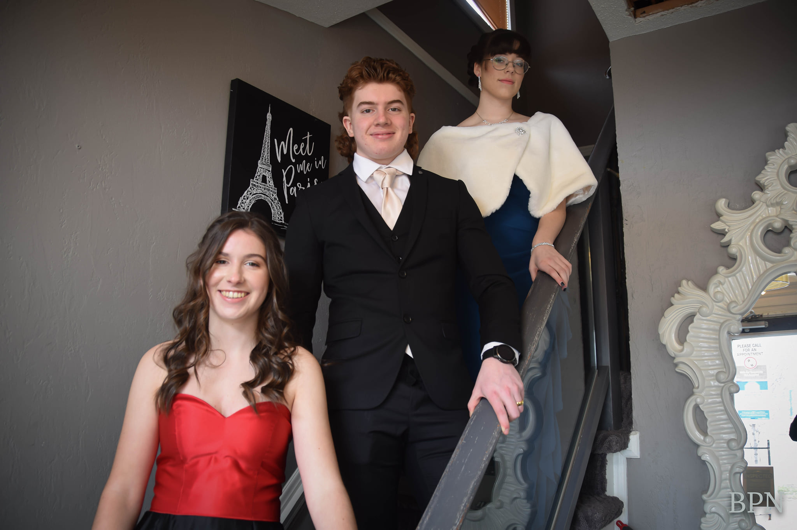
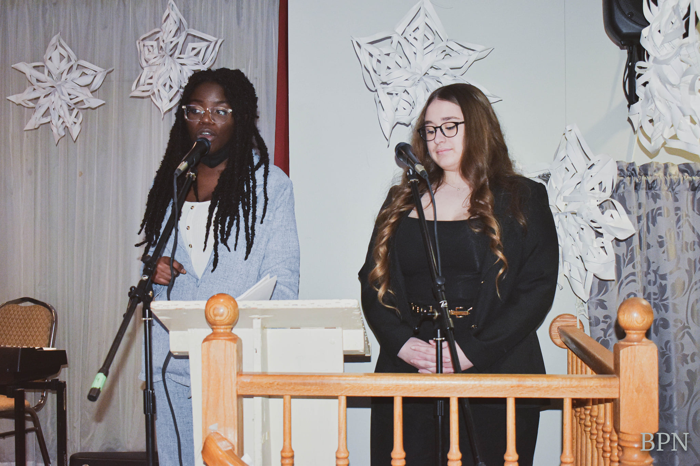
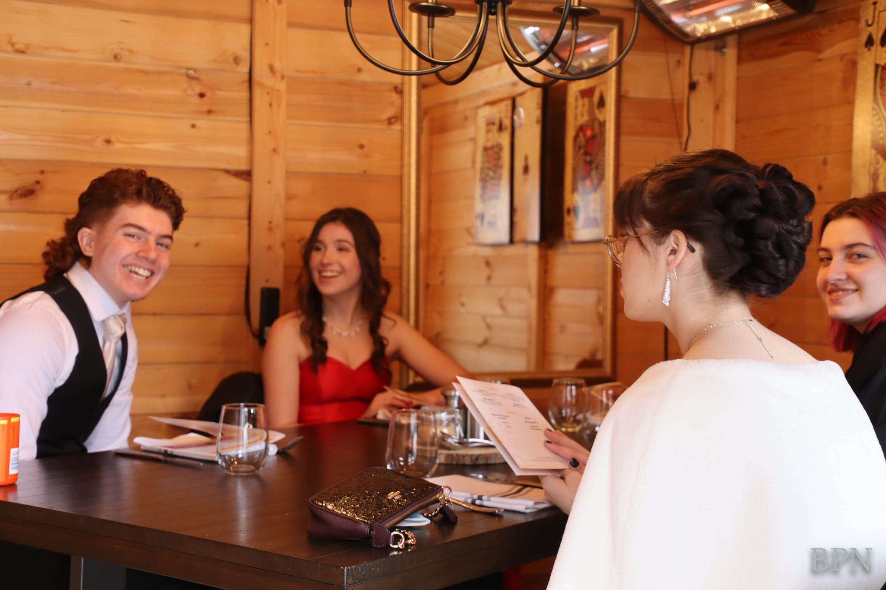
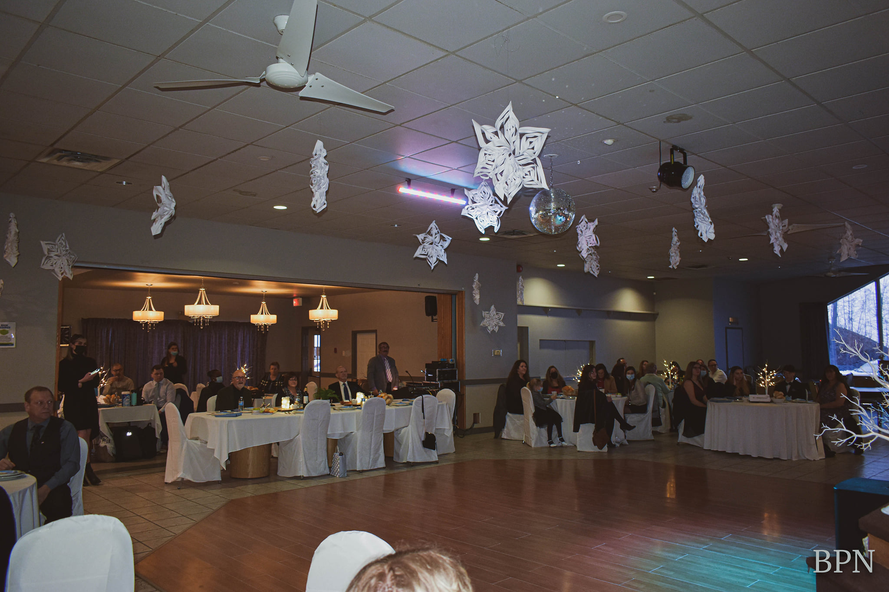
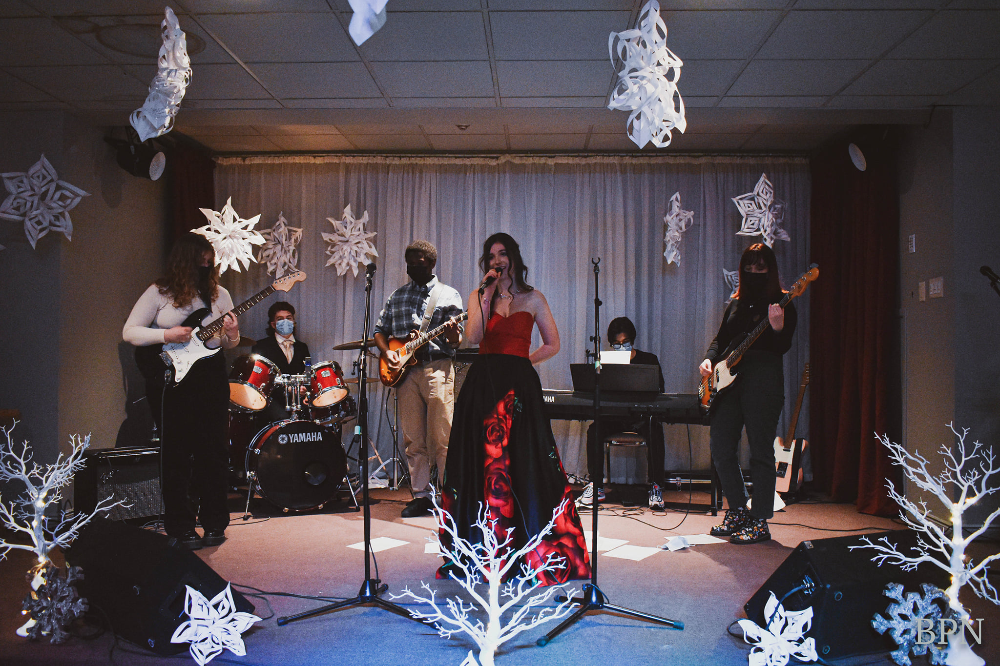
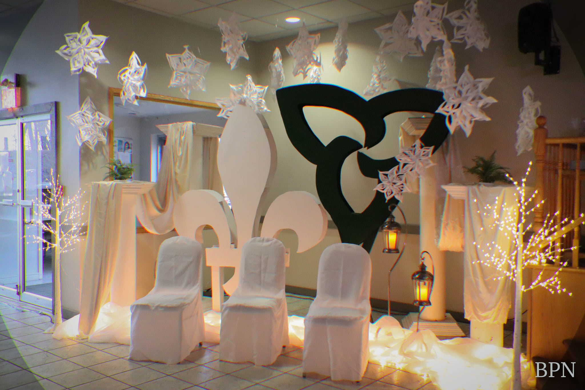
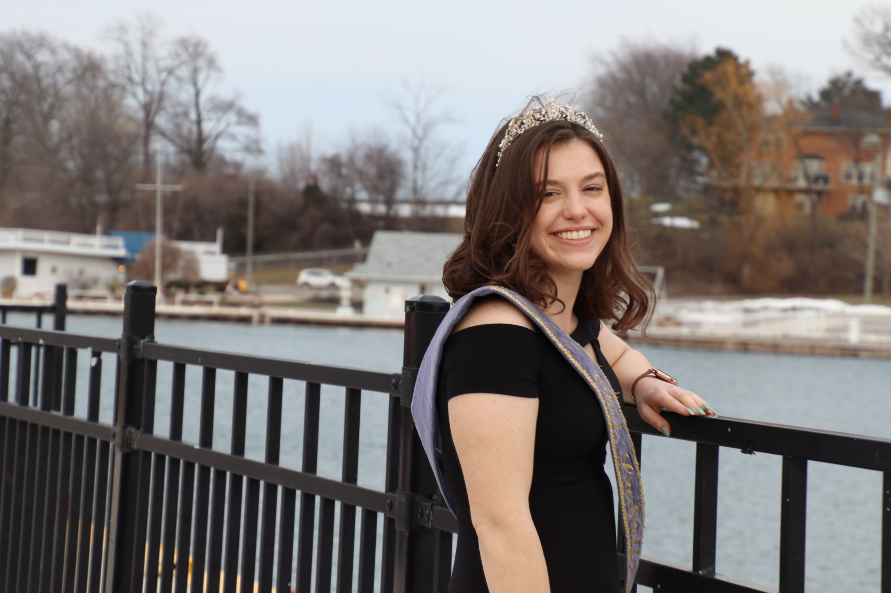
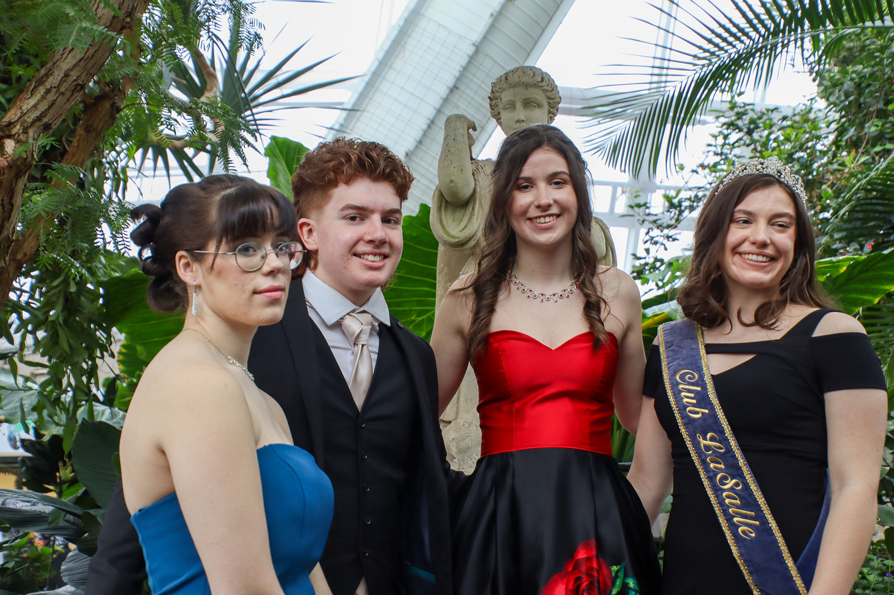
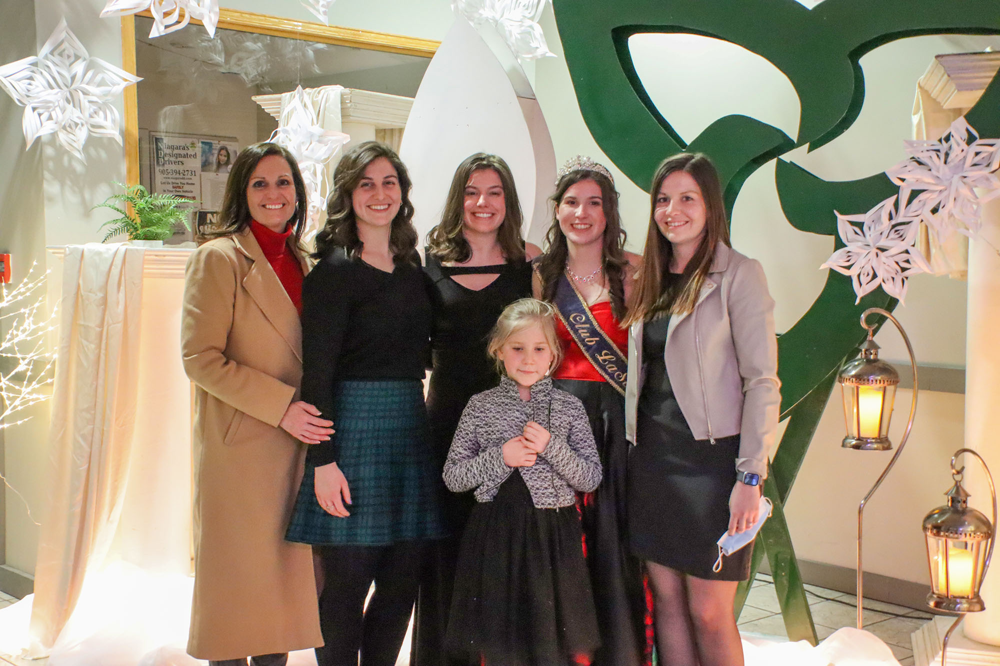

Après deux ans sans le couronnement de l’ambassadeur des francophones du Niagara en raison des restrictions associées à la pandémie, les bénévoles du Griffon animaient le 5 mars dernier, ce grand gala dans le cadre des cérémonies du Festival des arts populaires. Fidèle à cette tradition qui a lieu depuis une soixantaine d’années, la soirée fut planifiée avec pompe et fanfare. Pendant plusieurs jours, les bénévoles du Griffon avec une vingtaine d’élèves d’âge secondaire ont préparé le décor qui mettait en vedette le symbolisme du blanc du drapeau franco-ontarien. Ce dernier représente les hivers rigoureux de l’Ontario et de la vitalité des Canadiens français qui ont transformé ce paysage dans une communauté vibrante et vivante.

Le jour même du gala, les candidats (ates) ont reçu le traitement royal. La coiffure à un salon de haute gomme, la tournée en limousine, le petit dîner à Niagara, la tournée de quelques sites touristiques, la prise de photos ont fait partie des petites gâteries dont les aspirants (antes) ont joui.

Au gala, les candidats (es) se sont distingués (es) pour leur conviction à leur identité franco-ontarienne telle que manifestée dans leurs discours. Tour à tour, ils ont répondu avec confiance aux questions présentées par les juges. L’orchestre de l’école St. Jean-de Brébeuf ainsi que les animatrices ont ajouté un cachet spécial au déroulement du gala. À la fin de la soirée, les juges ont eu le défi de choisir la nouvelle ambassadrice, le nouvel ambassadeur de la communauté francophone du Niagara parmi ces trois jeunes vedettes évidemment bien motivés. Suite aux délibérations, Mia Wendling a été couronnée comme la nouvelle ambassadrice. Les spectateurs étaient tous d’accord que les témoignages de ces jeunes ainsi que la qualité de l’animation de la soirée représentent une lueur d’espoir pour la communauté francophone de la péninsule. Le travail du Griffon avec ses partenaires communautaires à impliquer les jeunes demeurent une stratégie payante dans la vitalité de la communauté franco-ontarienne.
