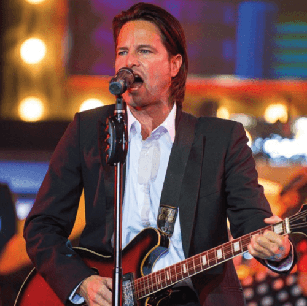

import {Carousel} from "react-bootstrap";

<Carousel className="mb-5 bg-black">
<Carousel.Item>

</Carousel.Item>
<Carousel.Item>

</Carousel.Item>
<Carousel.Item>

</Carousel.Item>
<Carousel.Item>

</Carousel.Item>
<Carousel.Item>

</Carousel.Item>
</Carousel>

Les invités du Club Les bons vivants et du Griffon ont jouit de tout un spectacle le mercredi 2 mars !  Ce chanteur polyvalent a dégagé une aisance sur la scène et une fougue de rocker en présentant des chants d’un palmarès qui en avait pour tous les goûts,  Il a présenté de façon remarquable des morceaux populaires de  son idole Johny Hallyday, d’Elvis Presley et de Johny Cash.  Talentueux au jeu de voix, il a interprété avec précision quelques grands  succès de Ginette Reno et d’Édith Piaf.  Pouvant ajuster sa voix de Baryton à Ténor, on aurait cru qu’il s’agissait d’Andrea Bocelli en personne.  Chanteur virtuose à la voix puissante, Rémy a diverti les gens pendant plus de 2 heures avec l'énergie d’une bête de scène.  La foule s’est levée à plusieurs occasions en applaudissant à cœur joie pour démontrer son appréciation du grand talent de se chanteur qui est une bougie d’énergie.  En quittant la salle, tous étaient d’accord que nous devons multiplier les occasions de jouir de spectacles enlevant de ce genre.  Suivez le site web du Griffon, legriffon.org pour vous tenir à jour sur les événements à venir.  Les bénévoles du Griffon sont enchantés de collaborer avec  le Club les bons vivants dans la réalisation d’activités divertissantes qui répondent aux besoins de la communauté francophone du Niagara.