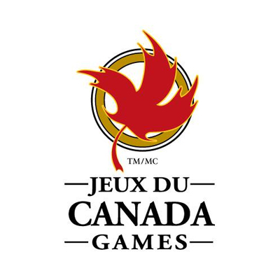
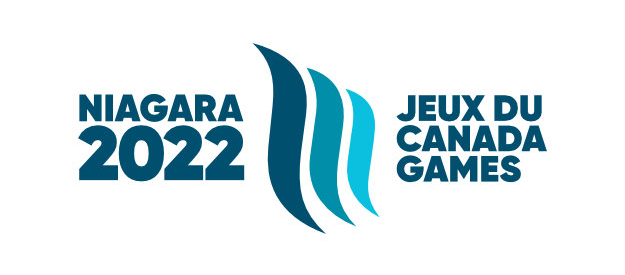

Les bénévoles du Griffon sont emballés de contribuer à la réalisation du Pavillon de la francophonie des jeux du Canada qui se dérouleront du 6 au 21 août 2022. Le pavillon mettra en vedette des artistes francophones de la région, une murale, « Tous les accents sont bienvenus », des captions de l’historique de la francophonie du Niagara ainsi que des activités diverses. Le programme qui sera offert au pavillon demeure en évolution. Veuillez communiquer avec nous si vous désirez contribuer à la réalisation de notre pavillon.

