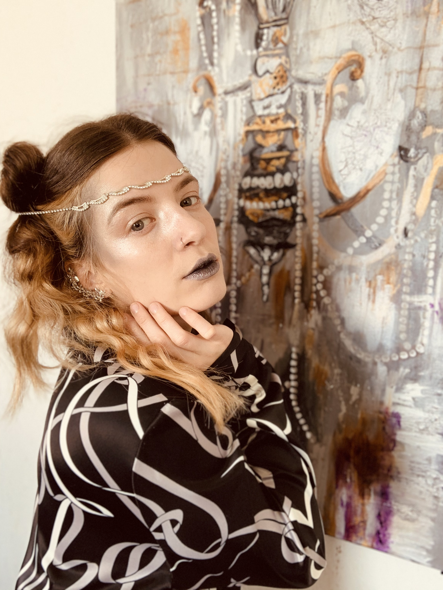
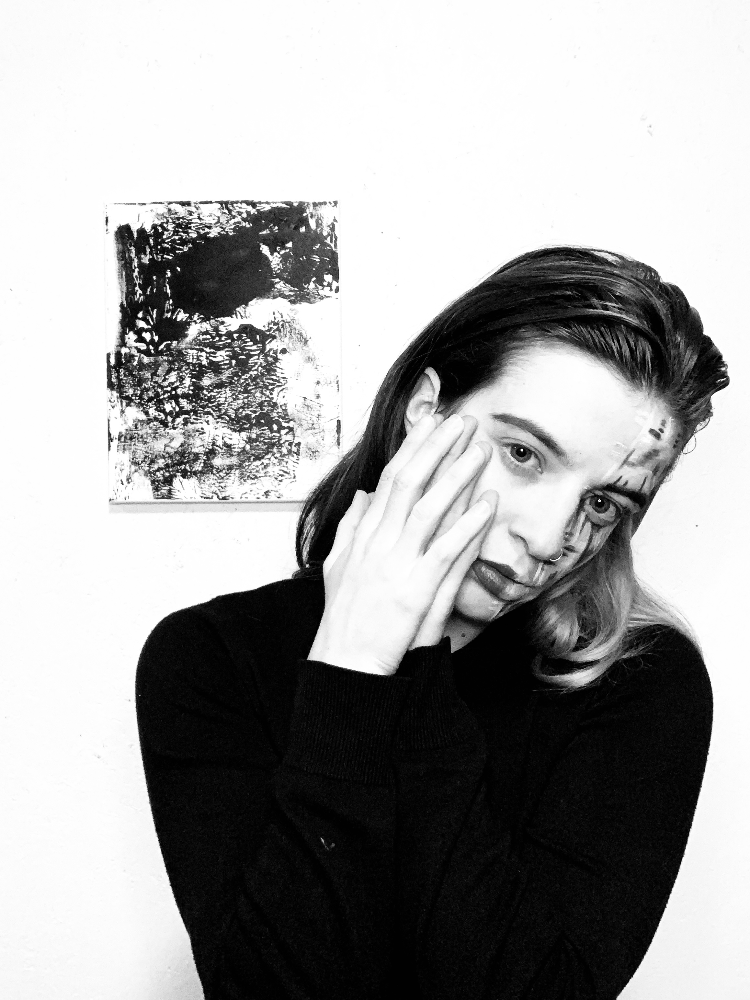

import {Carousel} from "react-bootstrap";

<Carousel className="mb-5 bg-black">
<Carousel.Item>

</Carousel.Item>
<Carousel.Item>

</Carousel.Item>
<Carousel.Item>

</Carousel.Item>
<Carousel.Item>

</Carousel.Item>
</Carousel>

Le Griffon est fier de mettre Andréa Létourneau en vedette au Pavillon de la Francophonie aux Jeux d’été du Canada. Jeunes artistes aux talents diversifiés, Andréa développera une toile, « Tous les accents sont bienvenus », en impliquant les gens au passage. Il s’agira d’une toile d’envergure à panneaux multiples portant sur les diverses disciplines sportives qui auront lieu durant les Jeux. De par sa grande créativité, il est certain que la production deviendra une pièce qui servira de témoignage à l’importance des jeux au développement du sport amateur à l’étendu du Canada. Andréa a gradué du programme des beaux-arts de l’Université York. Depuis 2015, elle s’illustre dans la péninsule du Niagara par ses productions originales et variées. L’étendue de son talent et de son palmarès de prix de mérite vous est présentée à partir de son site web, [Létourneau art](https://www.letourneauart.com). Il s’agit d’un petit trésor qui vaux la peine d’explorer, une perle franco ontarienne !