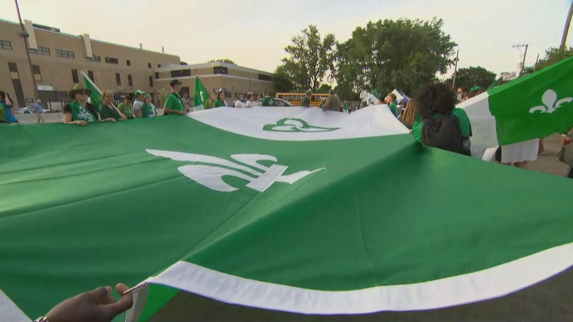

import Patrimoine from "../../../../components/Patriomoine";

## le 26 juin 2022

Le Griffon est fier de vous offrir la St-Jean à Welland avec les nombreux partenaires contribuant à la réalisation de la fête nationale des francophones suite aux dernières années de la pandémie.

### Au Programme
#### 8h30 à 10h30
- Déjeuner offert par le Club Richelieu de Welland
- Musique par Gilles Groleau

#### 10h45 à 12h
- Messe en plein air célébrée par le Père Guy Bertin Fouda

#### 12h à 16h
- Jeux gonflables, clown, jeux pour enfants, présentation de reptiles, jeux de cartes

#### 13h à 14h
- Spectacle par Suzan Le Clerk

#### 14h30 à 16h
- Les enfants affichent leurs talents artistiques

#### 15h
- Spectacle folklorique avec Denis Simoneau

#### 16h
- Magicien/illusionniste  Michel Huot

#### 17h
- Tirage de bicyclettes pour enfants et tirage 50/25/25

Nourriture à prix modique : poutine, hot dog, hamburger, crème glacée, friandises, breuvages

#### Journée thématique de vert et de blanc

<Patrimoine />

