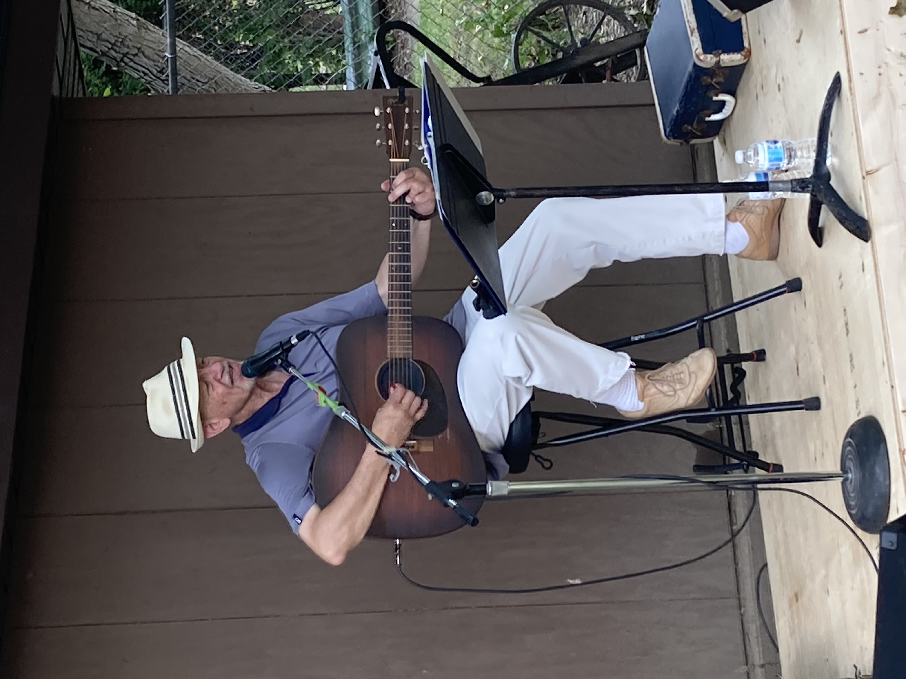
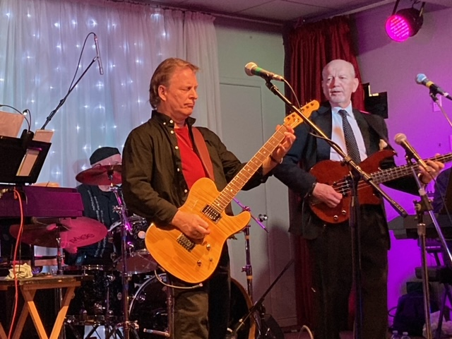

import {Carousel} from "react-bootstrap";

<Carousel className="mb-5 bg-black">
<Carousel.Item>

</Carousel.Item>
<Carousel.Item>

</Carousel.Item>
</Carousel>

Le Griffon est fier de mettre Gilles Groleau en vedette au Pavillon de la Francophonie aux Jeux d’été du Canada. Musicien et vocaliste, Gilles offre des spectacles à la communauté francophone du Niagara depuis l’âge de 15 ans. Issu de la communauté francophone de St. Catharines, Gilles vous présente un répertoire de chansons tirées du palmarès des plus grands succès des artistes français des années 70 jusqu’à présent. Venez nous visiter au Pavillon de la francophonie du 7 au 21 août.