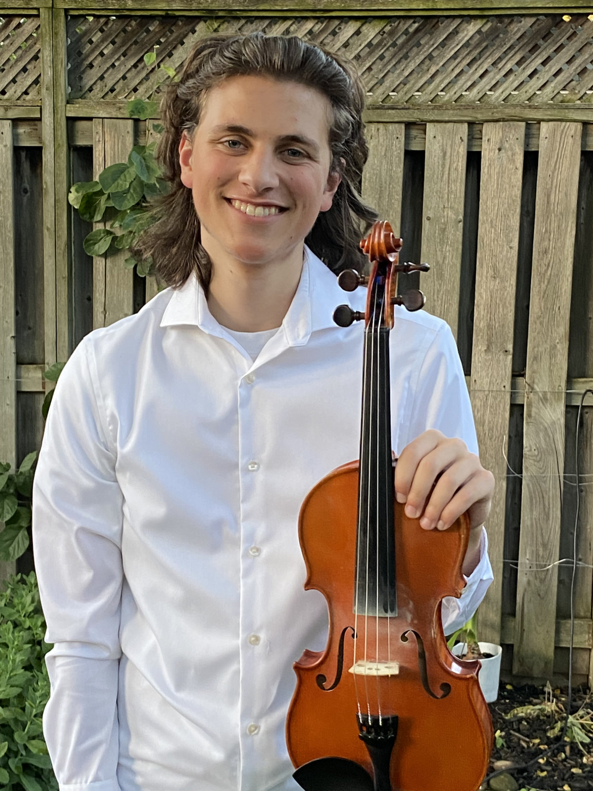
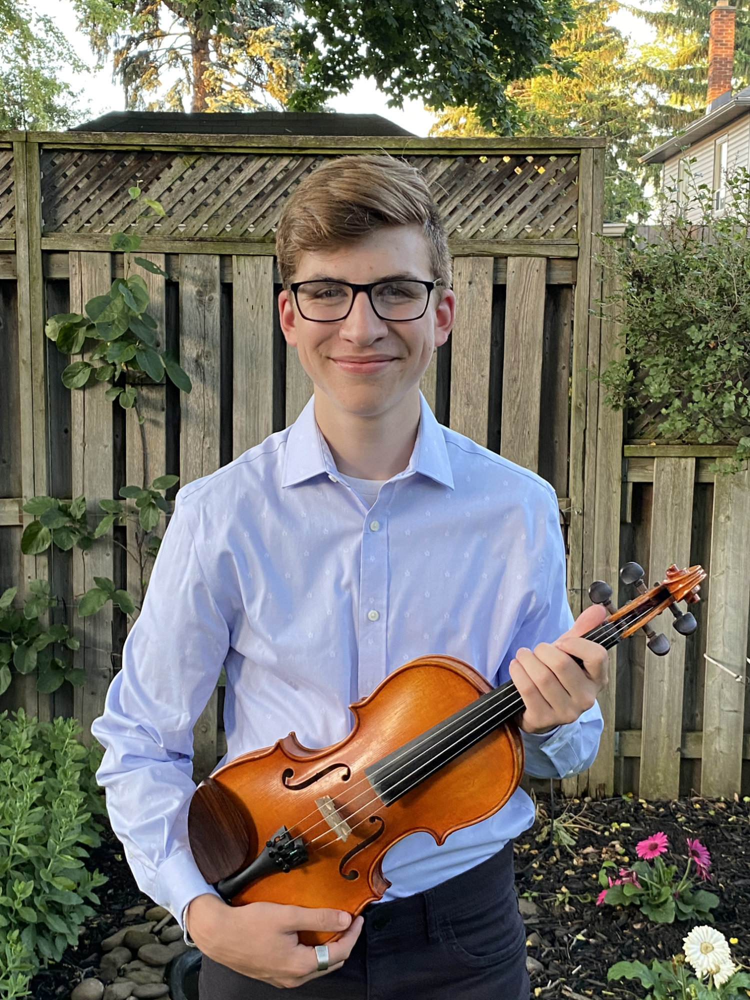

Simon Hauber

Malcolm Hauber

Simon Hauber et son frère cadet Malcolm sauront certainement vous divertir au Pavillon de la Francophonie aux Jeux d’été du Canada. Ces jeunes hommes brillants présentent des spectacles à la communauté francophone du Niagara depuis l’âge de 9 ans. Élève de onzième année à l’école St. Jean de Brébeuf, Simon fait partie de la troupe de musique de l’école soit en jouant du clavier ou au violon. Muni d’un grand talent musical, il anime des célébrations religieuses à la cathédrale depuis quelques années. Très talentueux avec un sens d’humour à la hauteur, il vous entrainera surement à danser un rigodon. Son frère cadet, suit Simon sur les talons prêt à prendre relève lorsque Simon sera aux études universitaires. Jeune musicien également très talentueux, Malcolm est également en vedette lors des soirées communautaires animées par le Griffon et ses partenaires. Venez nous visiter au Pavillon de la francophonie du 7 au 21 août.