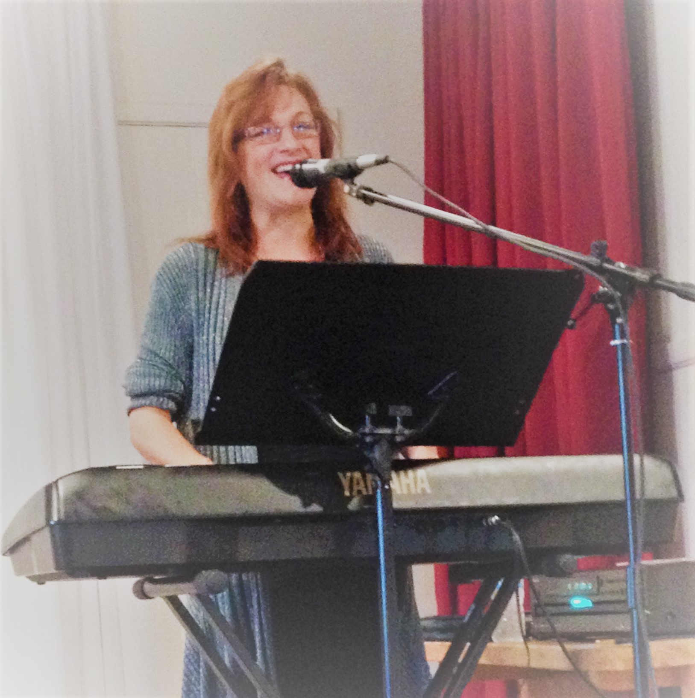

Le Griffon est fier de mettre Suzanah Taylor en vedette au Pavillon de la Francophonie aux Jeux d’été du Canada. Musicienne et vocaliste, Suzanah offre des spectacles à la communauté francophone du Niagara depuis son enfance. Issu des écoles francophones de St. Catharines, Suzanah est reconnue par sa voix douce et veloutée qui est toujours juste, partant des notes graves jusqu’aux notes aigües. Suzanah vous présente un répertoire de chansons tirées du palmarès des plus grands succès des artistes français des années 70 jusqu’à présent. S’assoir pour écouter un spectacle de Suzanah vous permet de prendre une pause du train de vie journalier mouvementé. Venez nous visiter au Pavillon de la francophonie du 7 au 21 août.