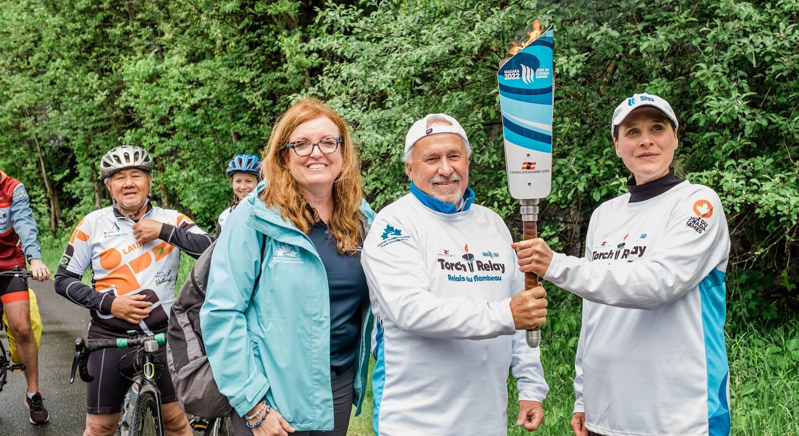

**WELLAND – Le plus gros événement bilingue de l’année en Ontario est sportif. Dans un mois, jour pour jour, du 6 au 21 août prochain, 5 000 athlètes et entraîneurs convergeront vers la péninsule du Niagara, région hôte des 28e Jeux du Canada. En coulisses, 450 des 4 000 volontaires veilleront à un accès égal du public et des athlètes aux deux langues officielles du pays.**

L’accueil du public, la signalétique, les annonces, les résultats… Tout doit être disponible en français et en anglais lors des Jeux du Canada. Quantité de francophones dans la région ont donc répondu à l’appel du comité d’organisation pour s’engager dans ce défi autant sportif que linguistique. Près de 13 % des volontaires seront bilingues. C’est le cas de Chloé Bremner, élève l’École secondaire catholique Saint-Jean-de-Brébeuf à Welland.

Pour garantir l’adhésion et l’engagement de la communauté, le secteur des Langues officielles a signé des partenariats avec l’Assemblée de la francophonie de l’Ontario (AFO), les conseils scolaires de langue française, ainsi que des regroupements communautaires et des employeurs bilingues de la région.

Les chefs du comité des Langues officielles siègent aux rencontres de tous les sites compétitifs et ailleurs, comme au Village des athlètes, pour assurer un accueil aux participants dans la langue de leur choix.

Un pavillon de la francophonie sera situé à la Place Niagara, sur la place du Parc des Jeux du Canada, et une programmation continue, assurée par l’AFO et le Centre communautaire Le Griffon aura pour thème Tous les accents sont les bienvenus.

**Une toile vivante et de l’artiste André Létourneau et une programmation musicale présentée par Le Griffon sont parmi les activités qui se déroulent chaque jour du 7 au 21 août. De plus, sur la grande scène de la Place Niagara, une heure est consacrée à la musique française plusieurs fois par semaine à 14h45.**

Lisez plus sur [le site ONFR](https://onfr.tfo.org/la-francophonie-du-niagara-au-coeur-des-jeux-du-canada/).