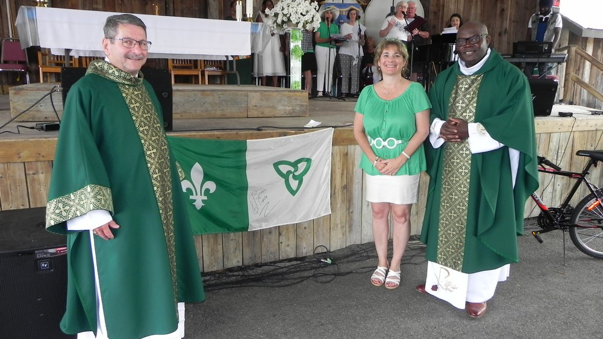
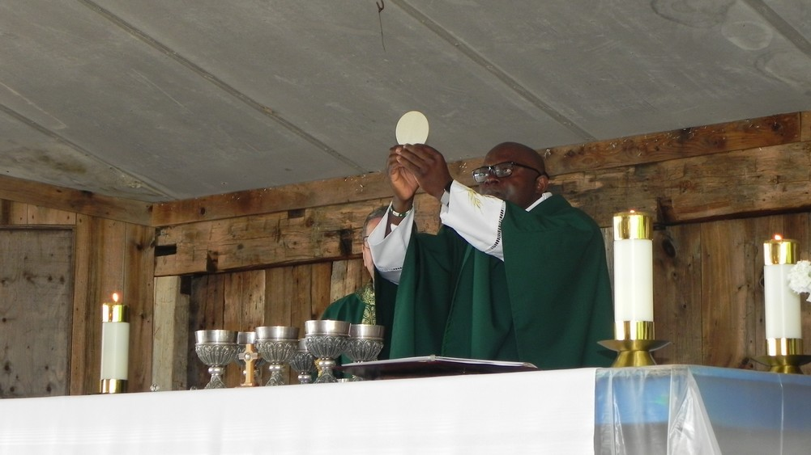

import {Carousel} from "react-bootstrap";

<Carousel className="mb-5 bg-black">
<Carousel.Item>

</Carousel.Item>
<Carousel.Item>

</Carousel.Item>
<Carousel.Item>

</Carousel.Item>
<Carousel.Item>

</Carousel.Item>
<Carousel.Item>

</Carousel.Item>
<Carousel.Item>

</Carousel.Item>
<Carousel.Item>

</Carousel.Item>
<Carousel.Item>

</Carousel.Item>
<Carousel.Item>

</Carousel.Item>
</Carousel>

Les francophones de la région étaient heureux de se rencontrer à l’Auberge le dimanche 26 juin pour célébrer la grande fête de la St-Jean. Les nombreux partenaires impliqués dans la réalisation de notre fête nationale s’étaient investi à plein afin que la rencontre soit un grand succès. Matinale de nature, les gens se sont rencontrés à l’Auberge tôt le matin pour un déjeuner préparé par nos frères Richelieu. Pour ajouter à l’ambiance, Gilles Groleau présentait un répertoire de chansons francophones tirées du palmarès des plus grands succès des artistes français des années 70 jusqu’à présent. Les gens ont bien apprécié la voix veloutée de notre artiste résident.

Fidèle à la tradition de la St-Jean à Welland, le Père Guy Bertin Fouda a animé la messe du dimanche sur les lieux. Ce fut une célébration dominicale de toute beauté animée par la chorale et quelques invités de Toronto. Évidemment le chant contribue énormément à la réflexion et à l’appréciation du message de vie présenté à la messe du dimanche.

Après la messe, les enfants ont pu s’amuser aux jeux gonflables, visiter une exposition de reptiles, se faire divertir par un clown et participer aux jeux animés par la garderie, la Boîte à soleil. Il y avait même le maquillage à la figure offert par le Centre de santé communautaire Hamilton/Niagara.

Pour les adultes, Suzan Le Clerk a présenté un spectacle comprenant des morceaux tirés du répertoire des grandes chansons françaises, d'Amérique latine, de jazz, style classique puis cabaret en plus de quelques compositions originales. Denis Simoneau et son épouse Edith Toscher ont entretenu les gens avec des chansons à répondre et des danses traditionnelles d’antan. Les dignitaires de la région étaient sur les lieux pour offrir leurs salutations. Les gens pouvaient déguster de la poutine, hamburgers, hot dogs et crème glacée tout au long de la journée. Le programme de la journée fut couronné par le spectacle du magicien, illusionniste, Michel Huot. Beaucoup plus qu’un magicien, Michel a fait rire et lever la foule. De par ses tours de magie avec des cartes, son grand sens d’humour, la fin de la Fête St-Jean fut véritablement magique. Deux jeunes participants à la fête ont joué de chance en recevant le prix de deux bicyclettes courtoisies de la Caisse Populaire Desjardins.

La journée fut un grand succès à tous les niveaux grâce aux bénévoles des divers partenaires communautaires. Il s’agissait d’un groupe d’une trentaine de bénévoles, et même plus qui ont travaillé ensemble pour réaliser cette tradition canadienne française. Nous tenons à féliciter Muriel Thibault-Gauthier, le Père Guy Bertin Fouda et le comité organisateur pour ce grand succès !
