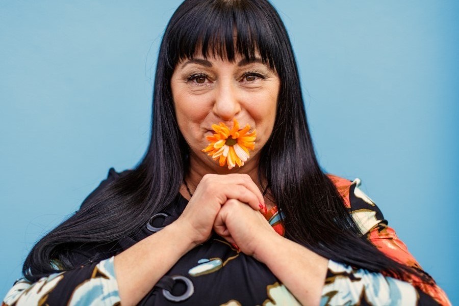

Le Griffon est fier de mettre en vedette ce trio de Niagara Falls composé de Mme Suzan Le Clerk, auteur-compositeur-interprète, Marcela Lagunas, violoncelliste et Luis Gerardo Molina, pianiste-arrangeur au Pavillon de la Francophonie aux Jeux d’été du Canada. Dans ce spectacle intitulé "Belle est la vie", d’une durée d’une heure, vous entendrez des compositions originales, créées par Mme Suzan Le Clerk et Daniel Jean Baptiste ainsi que des morceaux choisis dans le répertoire de grandes chansons françaises, d’Amérique latine, de jazz, style classique puis cabaret.

Les arrangements et le mélange des trois talentueux artistes offrent un spectacle haut en couleur, au son riche, original et authentique. Venez nous visiter au Pavillon de la francophonie du 7 au 21 août.