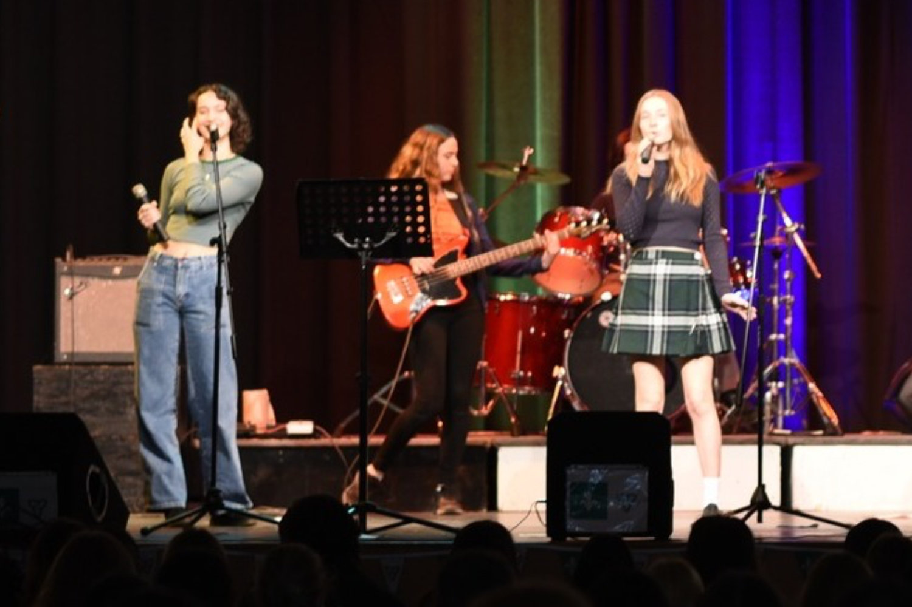
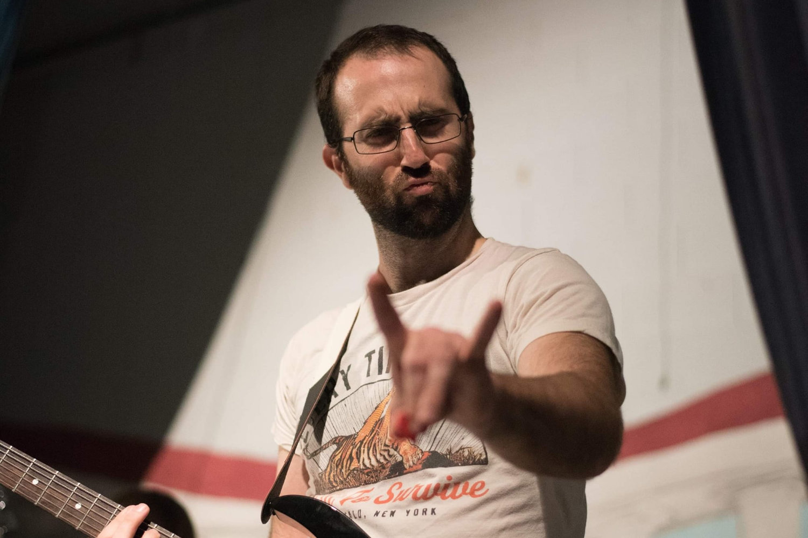

Laurenda Irwin, Mia Nanini, Mia Wendling, Simon Hauber, Alice Audet, Nova Gower et Emily Davidson font des répétitions depuis plusieurs semaines afin de vous divertir au Pavillon de la Francophonie aux Jeux d’été du Canada. La troupe musicale sous la direction de M. Jean-Louis Frado a complété plusieurs spectacles depuis septembre dernier en plus de jouer pour les élèves à la cafétéria de l’école à tous les vendredis. Muni d’un grand talent musical, ces jeunes artistes s’investissent à parfaire leurs compétences afin d’être au sommet de leurs arts. Dès septembre prochain, ils seront en vedette sur le char allégorique du Griffon dans la Grande Parade du Niagara Wine Festival.

Venez nous visiter au Pavillon de la francophonie du 7 au 21 août.
