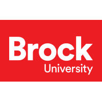
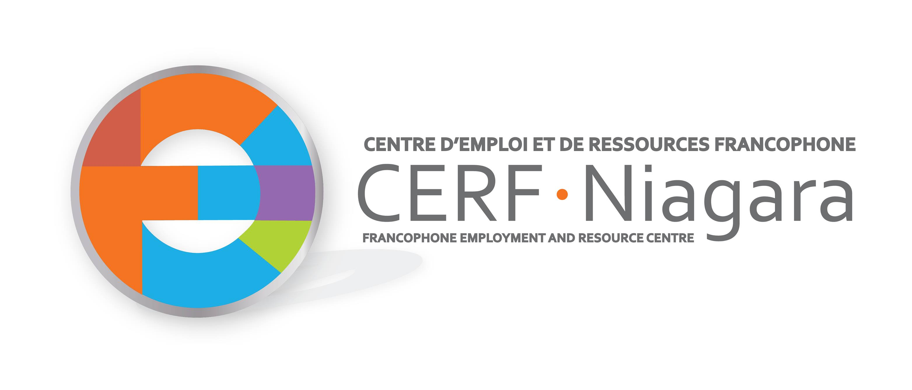
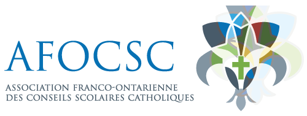
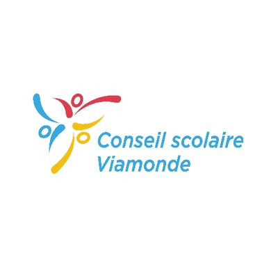
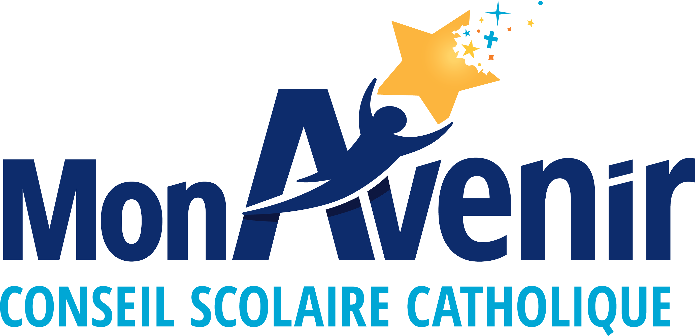
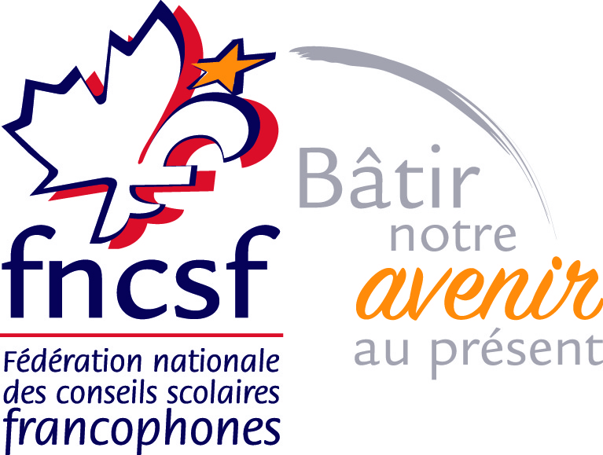

Plusieurs partenaires ont collaboré depuis plusieurs mois à créer le magnifique Pavillon de la Francophonie aux Jeux d’été du Canada 2022. Le chapiteau est le premier de son genre pour les francophones et nous en sommes très fiers. Parmi les acteurs principaux, nous avons à remercier l’Assemblée de la francophonie de l’Ontario qui œuvre à assurer la vitalité de l’espace francophone à tous les niveaux aux quatre coins de la province. Il faut également souligner le travail de Susan Morin, présidente du Comité des langues officielles des Jeux. En tant que chef de fil du tourisme depuis plus de 15 ans et membre du Comité de candidature Niagara 2022, Susan est une voix puissante et convaincante pour la communauté francophone du Niagara. En principe, elle fut le moteur du Pavillon. Sa main droite, Julie Johanis, a également joué un grand rôle au développement du branding du Pavillon, « Tous les accents sont bienvenus ». Julie est la gestionnaire des langues officielles, du design et marketing aux Jeux du Canada à Niagara. De plus, l’Assemblée de la francophonie de l’Ontario a prêté main forte en nous offrant les services de Melissa Beaudet et de Caroline Roy dans l’organisation et la réalisation du Pavillon. Peter Hominuk, directeur général de l’Assemblée de la francophonie a passé quelques jours à animer au Pavillon et nous avons également reçu l’appui de Carol Jolin, président de l’AFO. Carol a été l’ambassadeur de la francophonie depuis le début des jeux. Nous avons également reçu l’aide de plusieurs bénévoles du cours de français de 4e année de l’Université Brock, stage de travail en milieu francophone. Les étudiants inscrits au cours ont fait l’accueil des gens au passage en plus de faire le maquillage des enfants qui sont venus visiter le Pavillon.

Les activités culturelles au sein du chapiteau seraient impossibles sans l’investissement de nos partenaires en éducation de langue française. Le conseil scolaire Viamonde, le conseil scolaire catholique MonAvenir, la Fédération nationale des conseils scolaires francophones, l’association franco-ontarienne des conseils scolaires catholiques, CERF Niagara et l’Université Brock. Il était intéressant de parler à plein d’athlètes et de visiteurs d’une mer à l’autre qui avaient fréquentés des écoles de langue française.

Pour les jeux à venir, notre expérience à Niagara servira comme recette de succès pour la francophonie du Canada.

Veuillez continuer à nous suivre ici, sur notre site web et <a href="https://www.facebook.com/profile.php?id=100074350820299" target="_blank">la page Facebook du Griffon</a> pour les nouvelles de la deuxième semaine des jeux.

