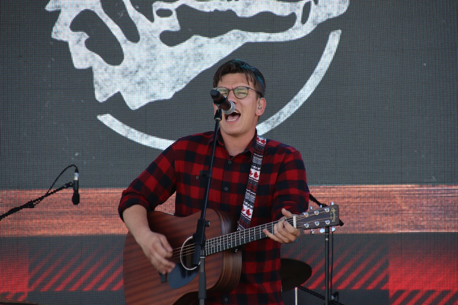
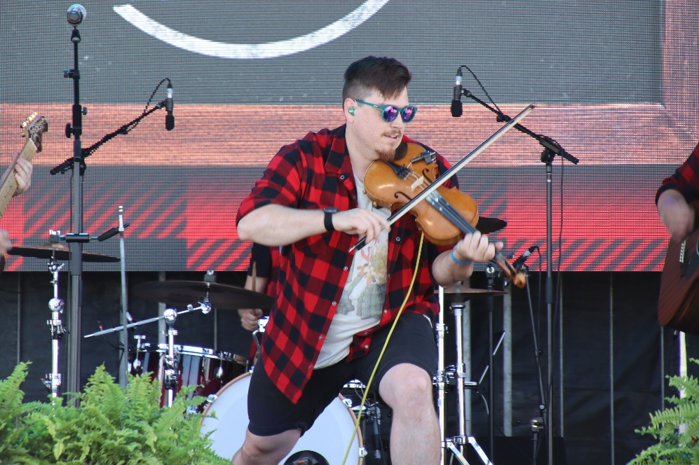
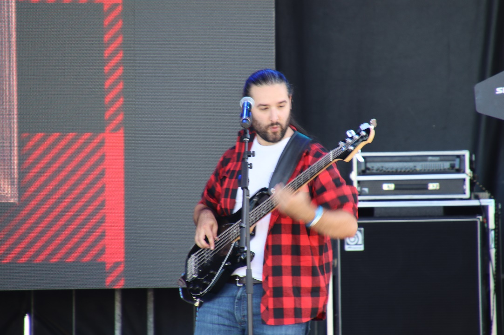
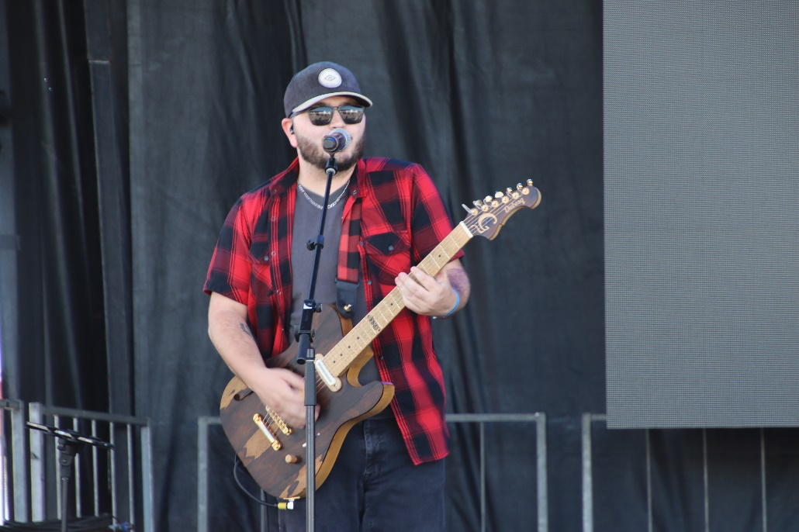
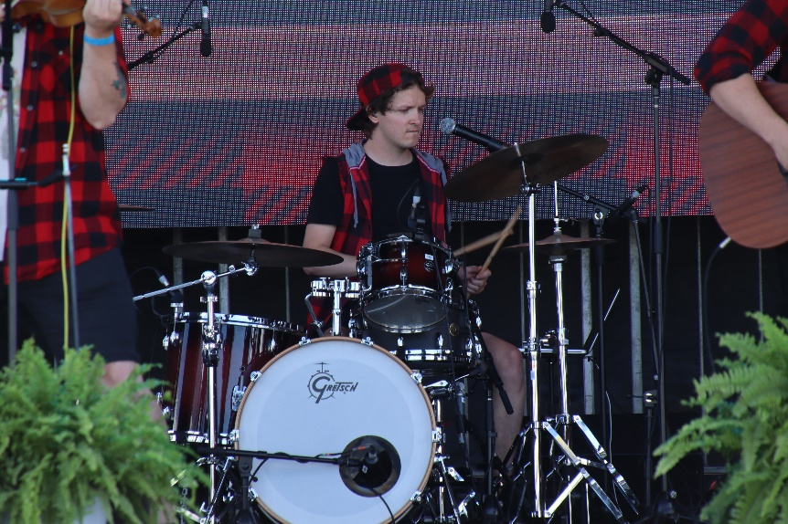
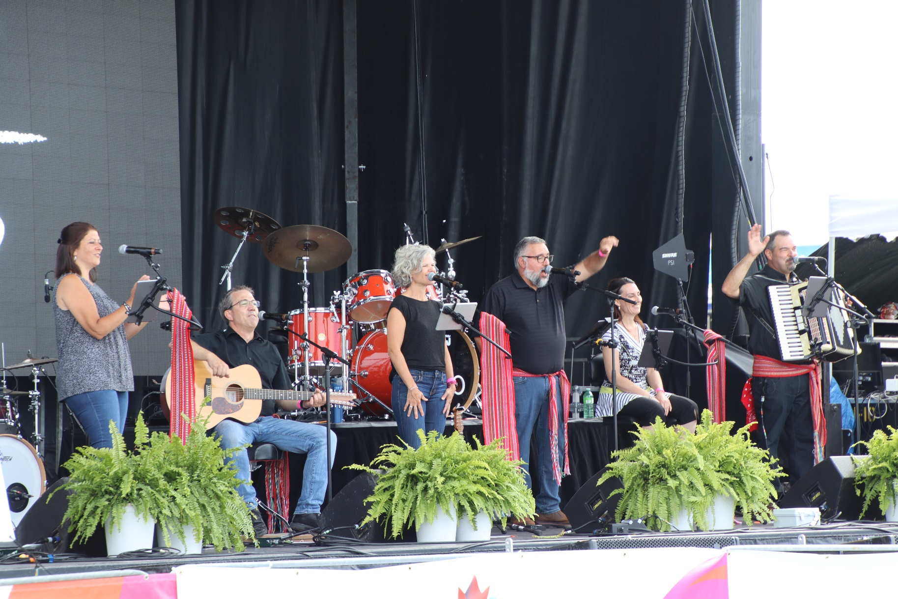

Introduis comme des groupes folkloriques de l’Ontario francophone à la saveur Celtic, les Rats d’Swompe et les Gens du Nord ont présenté des spectacles énergisants dignes de leur réputation, celle-ci, qui les précède aux quatre coins de la province. Le public emballé, a tapé du pied et danser des rigodons tout au long de leurs spectacles qui font vibrer le folklore de l’Ontario français. Ainsi, la mission des deux groupes est de promouvoir la culture franco-ontarienne ainsi que la musique francophone partout où il y a un public prêt à vivre une expérience marquante imprégnée du patrimoine franco-ontarien. Cette semaine, les gens ont eu l’occasion de vivre un vrai party de cuisine de chez nous, dans la grande tradition de notre communauté francophone. Nos artistes contribuent à la vitalité de la communauté franco-ontarienne !
Veuillez nous suivre sur le site Web du Griffon pour les nouvelles de la deuxième semaine des jeux.

import {Carousel} from "react-bootstrap";

<Carousel className="mb-5 bg-black">
<Carousel.Item>

</Carousel.Item>
<Carousel.Item>

</Carousel.Item>
<Carousel.Item>

</Carousel.Item>
<Carousel.Item>

</Carousel.Item>
<Carousel.Item>

</Carousel.Item>
<Carousel.Item>

</Carousel.Item>
</Carousel>