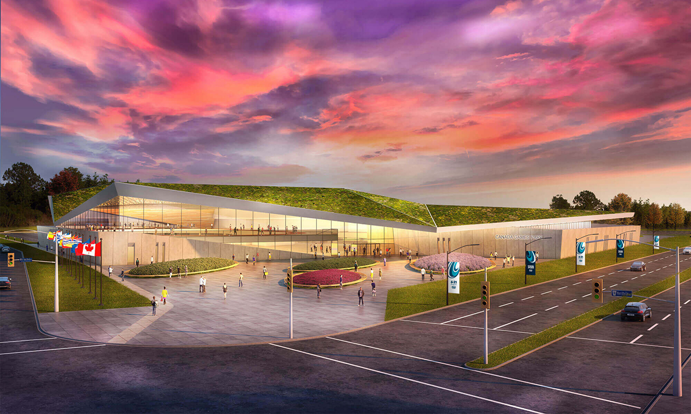

<h2 class="pt-4">Programme musicale</h2>

Le dimanche 7 août de 14h45 à 16h

[Gilles Groleau](/posts/2022/06/gilles-groleau-en-vedette)

    
Le lundi 8 août de 13h à 14h30

    

[L’Orchestre de St-Jean-de-Brébeuf](/posts/2022/07/troupe-musicale-sjb-en-vedette)

    
Le mardi 9 août de 14h45 à 16h

    

[Simon et Malcolm Hauber](/posts/2022/06/simon-et-malcolm-hauber-en-vedette)

    
Le mercredi 10 août de 14h45 à 16h

    

[Suzan Le Clerk](/posts/2022/07/suzan-le-clerk-en-vedette/)

    
Le jeudi 11 août de 12h à 13h15

    

[Suzanah Taylor](/posts/2022/06/suzanah-taylor-en-vedette/)

    
Le vendredi 12 août de 12h à 13h15

    

[Simon et Malcolm Hauber](/posts/2022/06/simon-et-malcolm-hauber-en-vedette)

    
Le samedi 13 août de 12h à 13h15

    

[Suzanah Taylor](/posts/2022/06/suzanah-taylor-en-vedette/)

    
Le dimanche 14 août de 16hà 17h

    

[L’Orchestre de St-Jean-de-Brébeuf](/posts/2022/07/troupe-musicale-sjb-en-vedette)

    
Le lundi 15 août de 16h à 17h

    

[Simon et Malcolm Hauber](/posts/2022/06/simon-et-malcolm-hauber-en-vedette)

    
Le mardi 16 août de 12h à 13h15

    

[Suzanah Taylor](/posts/2022/06/suzanah-taylor-en-vedette/)

    
Le mercredi 17 août de 15h45 à 17h

    

[Suzan Le Clerk](/posts/2022/07/suzan-le-clerk-en-vedette/)

    
Le jeudi 18 août de 13h à 14h15

    

[Gilles Groleau](/posts/2022/06/gilles-groleau-en-vedette)

    
Le vendredi 19 août de 17 à 18h

    

[L’Orchestre de St-Jean-de-Brébeuf](/posts/2022/07/troupe-musicale-sjb-en-vedette)

    
Le samedi 20 août de 12h à 13h15

    

[Gilles Groleau](/posts/2022/06/gilles-groleau-en-vedette)

(Suivez les liens pour plus d'informations sur chacun des artistes)