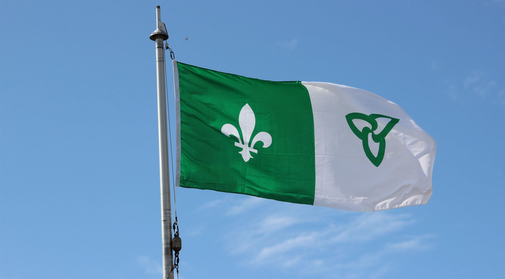

Le Griffon en collaboration avec l’Interagence francophone de Niagara vous invite à la levée du drapeau Franco-Ontarien **aux bureaux de la municipalité régionale de Niagara au 1815 Sir Isaac Brock Way à Thorold ce vendredi 23 septembre 2022, de 11h à 12h30** pour la 47e levée du drapeau, la communauté francophone se rallie pour une célébration régionale dans le but de démontrer de nouveau, notre vitalité. Les élèves de nos écoles feront partie de la fête.

Joignez-vous au groupe pour célébrer le fanion de la collectivité francophone de l’Ontario.