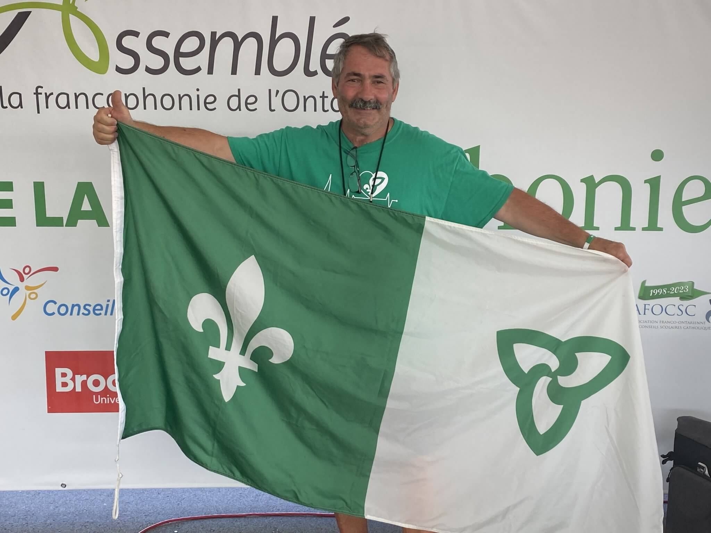

_Jean Chartrand, secrétaire et trésorier du Centre communautaire Le Griffon de Niagara. Crédit image : Soufiane Chakkouche_

De l’avis des observateurs in situ, la représentativité de la francophonie et l’accès à ses services aux Jeux de l’été du Canada 2022 qui se déroulent à Niagara du 6 au 21 août n’ont jamais été égalés dans l’histoire des Jeux, un travail qui inspire plus d’un…

« On assiste aujourd’hui, à Niagara, à la plus grande présence francophone aux Jeux du Canada depuis leur création. Cela fait vraiment plaisir et c’est pas mal justifié », confie fièrement Jean Chartrand.

Fier, le secrétaire et trésorier du Centre communautaire Le Griffon de Niagara peut l’être. En effet, avec, entre autres, une signalisation et une communication bilingue sur les sites de compétition et une armée de petits soldats bénévoles francophones reconnaissables à leur badge et leur drapeau franco-ontarien miniature, les visiteurs francophones ne peuvent s’égarer ou se plaindre d’une quelconque discrimination linguistique durant cette manifestation.

« Selon les dernières informations en ma possession, on est arrivé à 540 bénévoles bilingues avec 40 bénévoles qui travaillent ici, au pavillon francophone », estime Mélissa Beaudet, coordonnatrice du pavillon francophone.

Pour rappel, c’est la première fois dans l’histoire des Jeux qu’un pavillon dédié à la francophonie est dressé au cœur de ce centre névralgique de l’événement qu’est la place Niagara.

<a href="https://onfr.tfo.org/jeux-du-canada-2022-quand-le-modele-franco-ontarien-inspire/" target="_blank">[Lire la suite sur le site ONFR]</a>