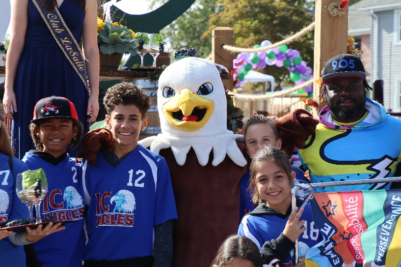
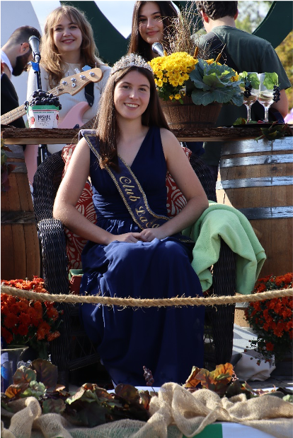

Pour une vingtième année, Le Griffon présentait un char allégorique dans la Grande Parade du festival du vin et du raisin de Niagara le samedi 24 septembre 2022. Le char mettait en vedette l’ambassadrice du Club La Salle, Mia Wendling. Garni d’une maquette du drapeau franco-ontarien, de fleurs, d’un bar et de vignes, notre entrée au défilé était décorée comme une terrasse à un vignoble de la région. L’orchestre de l’école St. Jean-de-Brébeuf interprétait un répertoire musical fort apprécié par la foule qui dépassait 50 000 spectateurs. Comme on le dit par chez nous, la troupe était « hot ». Tous les gens présents étaient emballés de se retrouver aux festivités suite à deux années d’absence en raison de la pandémie. Le lynx de l’école Saint-Jean-de-Brébeuf ainsi que l’aigle de l’école Immaculée-Conception étaient particulièrement populaires auprès des jeunes qui accompagnaient leurs parents. La directrice de l’école Immaculée, Mme Wendling, était accompagnée d’une vingtaine d’élèves et du président du conseil d’école, Gaston Mawaya. Grâce à l’investissement des bénévoles du Griffon et de la jeunesse francophone de la région, l’espace Franco-Ontarien demeure vivant et vibrant à Niagara.