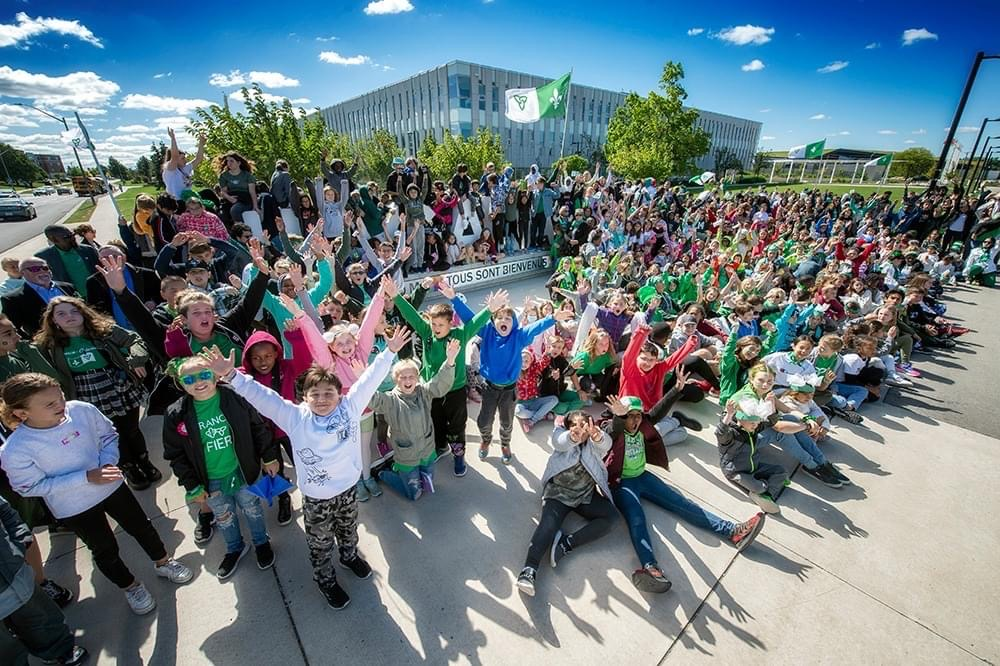

La levée du drapeau franco-ontarien est toujours une grande célébration pour les francophones de la région, toutefois cette année, la cérémonie fut un moment historique. Il s’agissait de la première fois que le drapeau fut hissé aux bureaux de la municipalité régionale de Niagara. Pour l’événement, plus de 400 enfants et adultes se regroupaient sur la terrace du bureau régional pour marquer l’anniversaire de la naissance de notre fanion à l’Université Laurentienne, le 25 septembre 1975. Parmi les invités, il y avait M. Jim Bradley, président du bureau régional de la municipalité de Niagara, M. Frank Campion, maire de la ville de Welland, M. Terry Ugilini, maire de la ville de Thorold ainsi que Melinda Chartrand et Joanne Thibodeau, conseillères scolaires du conseil catholique MonAvenir.

Il y avait de l’électricité dans l’air! Il s’agissait de la première rencontre en grand groupe pour notre communauté depuis longtemps. La cérémonie animée par Susan Morin fut enrichi par des discours et des témoignages soulignant l’importance de l’événement pour la collectivité francophone du Niagara. L’orchestre de l’école Saint-Jean-de-Brébeuf y était pour interpréter quelque chants qui sont chers aux franco-ontariens. Pour la levée, la chorale de l’école Immaculée Conception appuyée par la foule présente ont entamées notre hymne, « Je te chante mon drapeau » qui est devenu le symbole de la francophonie de l’Ontario. Il s’agit d’un moment qui soulève toujours le cœur des petits comme des grands!

Il est important de souligner que l’affiche au bureau régional de Niagara est maintenant bilingue grâce au travail de Susan Morin, nous avons à en être fier! Enfin, ce fut un moment fort en émotions et un témoignage de l’importance de notre jeunesse dans la relève des chefs de file du présent.
