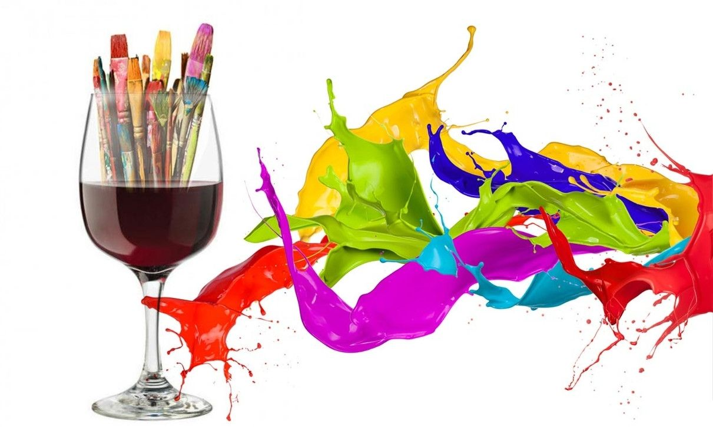
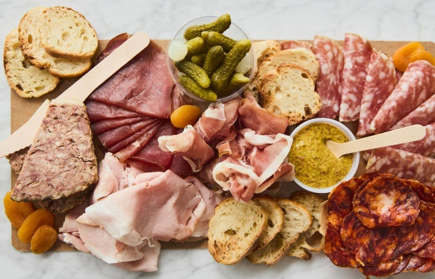

Le Griffon vous invite à une clinique de peinture artistique pour les débutants avec Andréa Létourneau.  Venez  compléter votre propre œuvre sous la tutelle d’Andréa, prendre un verre de vin servi avec fromage, crudités et charcuteries.

- **Quand**: Le jeudi 17 novembre

- **Lieu**: Salle Hamel à l’église Immaculée au 99 rue Garnet, St. Catharines

- **Durée**: De 19h à 21h

- **Coût**: 30$ et vous quittez avec un œuvre d’art personnel

- **Participants**: Maximum de 20 participants

Veuillez confirmer votre participation en communiquant avec Jean Chartrand au 905-685-2984. Nous offrons cette belle soirée de retrouvailles aux 20 premiers participants.

