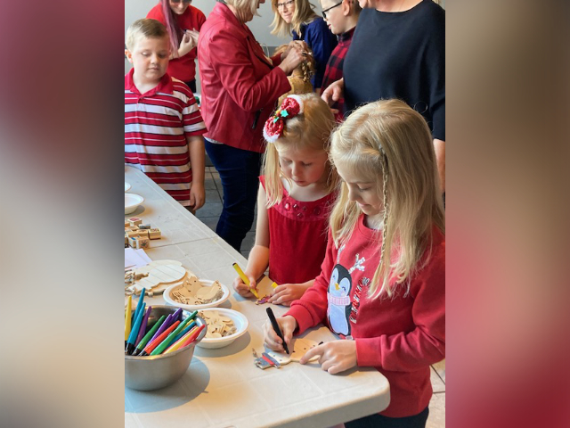

import {Carousel} from "react-bootstrap";

<Carousel className="mb-5 bg-black">
<Carousel.Item>

</Carousel.Item>
<Carousel.Item>

</Carousel.Item>
<Carousel.Item>

</Carousel.Item>
<Carousel.Item>

</Carousel.Item>
<Carousel.Item>

</Carousel.Item>
<Carousel.Item>

</Carousel.Item>
<Carousel.Item>

</Carousel.Item>
</Carousel>

La tradition du Noël des petits pour la communauté francophone de St. Catharines a pris naissance en 1975 sous la direction de Mme Thérèse Ducharme, une pionnière de l’animation culturelle pour les francophones de Niagara. Fidèle à son exemple, les bénévoles du Griffon accueillaient 50 enfants au Club pour cette grande fête annuelle. Il y avait de l’énergie dans l’air, on peut dire que les murs du Club en vibraient. En effet, les petits étaient accompagnés de leurs parents ainsi que de leurs grands-parents, il s’agissait d’une vrai rencontre familiale canadienne française. Il s’agissait de la 23ième édition du Noël animé par le Griffon.

Dès leur arrivée, les cinquante petits qui participaient à l’activité ont confectionné de jolis bricolages de Noël sous la direction de 5 élèves de l’école secondaire St. Jean de Brébeuf et de leur enseignante, Mme Danielle Chartrand.  Dans l’arrière-plan, Suzanah Taylor interprétait un répertoire de chant de Noël pour les gens de tout âge par son grand talent de vocaliste. « Comme elle a une belle voix,» fut le consensus des participants. De plus, quelques artistes faisaient du maquillage de Noël. Un goûter a également été offert aux familles présentes.

Comme pièce de résistance, le Griffon a offert aux enfants, un spectacle de magie et de jonglage par Alex Kazam et son collègue, Alejandro. Ce fut tout un spectacle pour les petits comme pour les grands. Alex, un ancien élève de nos écoles étaient en pleine forme. Les gens ont ris à cœur joie.

Vers quinze heures trente, Suzanah a rassemblé la foule d’enfants en chantant, « Voici le Père Noël » pour qu’ils accueillent Mère Noël et Père Noël. Attentifs à chaque geste de leurs hôtes, ils se sont assis près de Mère et de Père Noël pour écouter sans manquer un mot, une histoire de la veille de Noël. Tour à tour les petits sont allés visiter le couple à l’honneur pour recevoir un joli cadeau. « Soyez de bons enfants car le Père Noël est toujours à l’écoute et passez une vacance familiale rempli de joie et de partage, » fut le message d’adieu du Père Noël. Et cela résume une autre journée spéciale au domaine des francophones de Niagara !

Le Griffon s’engage à vous offrir une gamme de spectacle de qualité dans les mois à venir. Tenez-vous au courant à partir de notre site web ou de notre page Facebook.