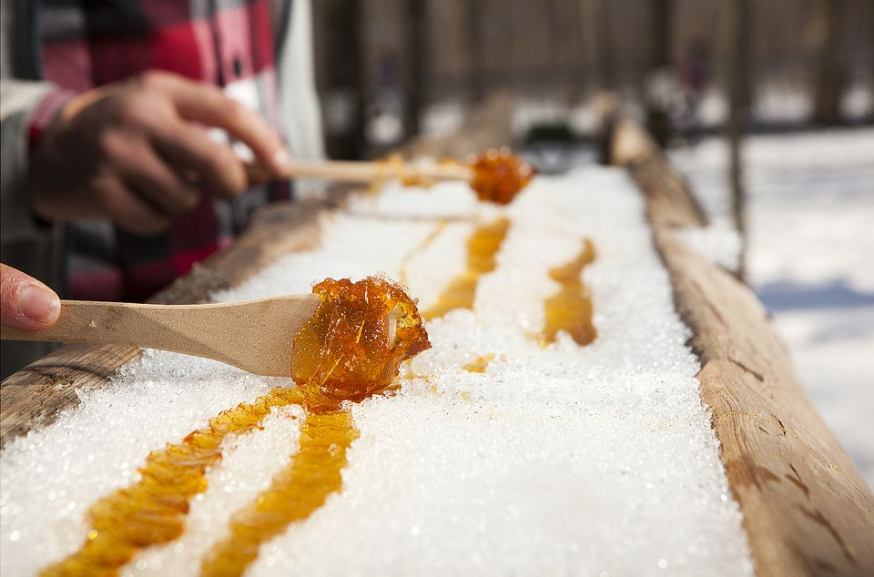
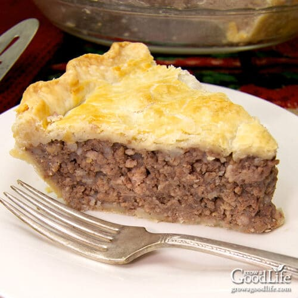
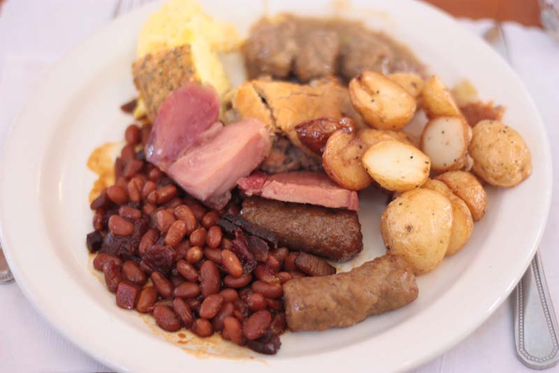

import Patrimoine from "../../../../components/Patriomoine";

## Le samedi 4 février 2023 au Club La Salle

### Déjeuner à compter de 10h

_Œufs brouillés, jambons, saucisses, fèves au lard, petites patates au four, (toast) garni de sirop d’érable_

#### Coût - 10$
#### Morceau de tourtière Franco-Ontarienne - 3$

### Spectacles:
- Gilles Groleau présente un répertoire de musique française

- Simon et Malcolm Hauber présentent des jigs et des reels

- Wayne Wall présente un répertoire de musique country bien connue en plus de morceaux contemporains populaires

### Les billets de 10$ pour le déjeuner sont vendus à l’avance et à la porte.

_Veuillez confirmer votre présence_

- Micheline Belleau 289-213-1060
- Monique à la paroisse 905-934-4266

<Patrimoine />