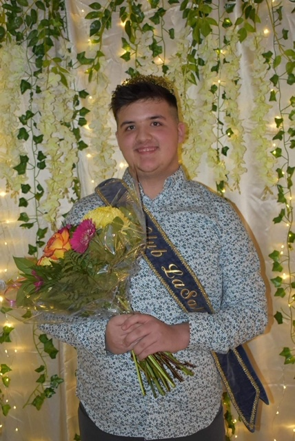
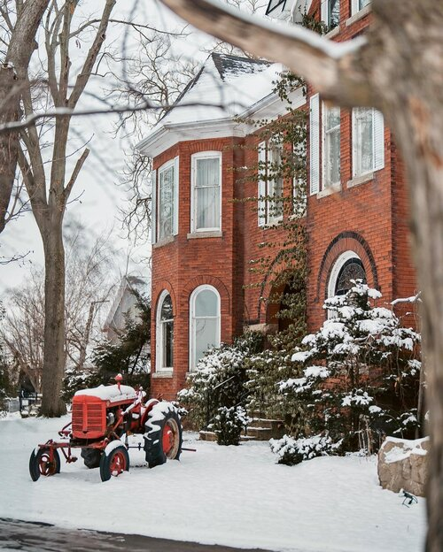
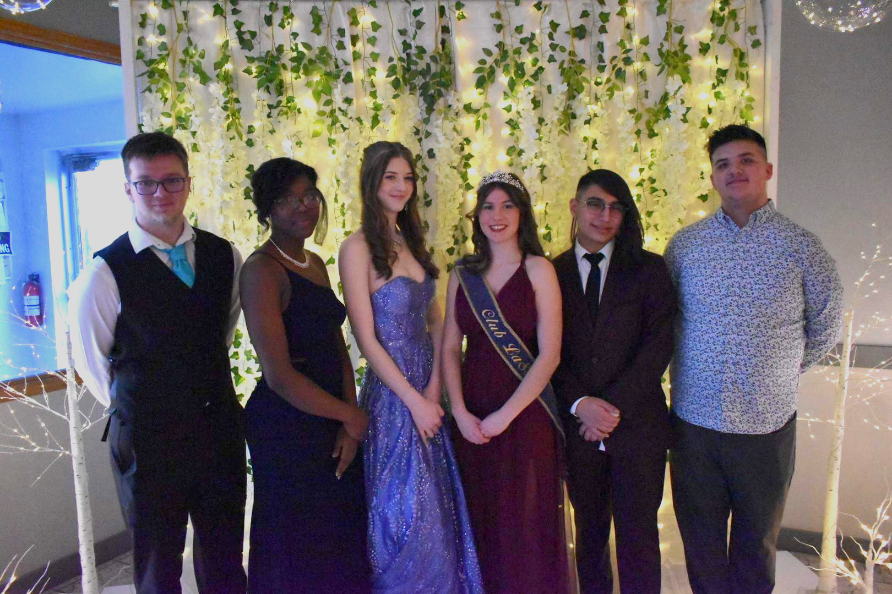

Le gala du couronnement de l’ambassadeur des francophones du 4 mars dernier fut réalisé avec pompe et fanfare dans la grande la tradition du Club La Salle, qui en effet réalisait le 65e couronnement depuis la création du Club en 1963. Ethan Couture, Paige Coles, Kai Martinez-Richer et Dora Tikeng Gruimzang étaient les 4 autres candidats qui se présentaient dans l’espoir de se mériter la couronne, qui en soi, représente toute une plume dans son chapeau.

Le gala est un événement tout à fait spécial célébré en grand. La journée même, les 5 candidats ont reçu le traitement royal au salon Videl’s. Ensuite, ils ont monté abord une belle limousine pour se rendre au vignoble Honsberger pour le dîner. Il s’agit d’un restaurant aménagé dans une maison coloniale où l’on sert des repas gastronomiques à partir d’aliments du terroir. C’est également l’endroit idéal pour prendre de superbes photos.

La prochaine escale au programme était une visite au marché Watering Can pour une prise de photos. Le marché est reconnu pour ses mises en scènes uniques, un joyau pour les photographes professionnels. Les candidats ont beaucoup joui de l’ambiance ainsi que du dessert servi, une pièce de résistance au marché.

Le cortège s’est rendu au Club vers 16h30 pour découvrir une salle transformée en une scène de bal. Le décor monté par Danielle Chartrand était tout à fait génial et de mise pour le gala.

Les cinq aspirants à la couronne ont rencontrés les juges en premier lieu pour une entrevue à huis clos. Suite à l’entrée formelle, les candidats et les participants ont savouré un excellent repas préparé par Micheline Belleau. Vers 19h30, l’animatrice, Justine Wendling a entamé le concours. Tour à tour, les candidats ont présenté leurs discours. Ils devaient ensuite répondre à une question préparée et finalement à une question improvisée. Parmi les nombreuses compétences de l’ambassadeur, cette personne doit être en mesure de prendre la parole en public sans trébucher. L’orchestre de l’école St.Jean-de-Brébeuf animait la soirée. Mia Wendling, Isabelle Richardson, Jesse Robert, Malcolm Hauber et Emily ont présenté un répertoire qui s’intégrait parfaitement à la soirée. Les gens ont été fort impressionnés par ses jeunes vedettes. Nous tenons à souligner que Mia Wendling a été choisi comme l’ambassadrice du Folk Arts Festival parmi les 26 clubs impliqués. Il s’agit de toute une palme pour Mia.

Suite à une longue délibération par les juges, Jeffrey Bell fut présenté comme l’ambassadeur 2023. Il sera appuyé par Kai Martinez-Richer. Il est important de mentionner que tous les candidats se sont très bien présentés, nous avons à en être fiers ! Il faut de la conviction pour se présenter devant une foule au gala, cela fait partie de cette grande tradition. C’est une expérience qui a ouvert une porte sur l’avenir pour une quantité d’adolescent.

Ainsi se terminait une autre soirée culturelle qui permet à nos adolescents de s’identifier à la collectivité franco-ontarienne, un exercice fondamentale à la vitalité de notre communauté.

