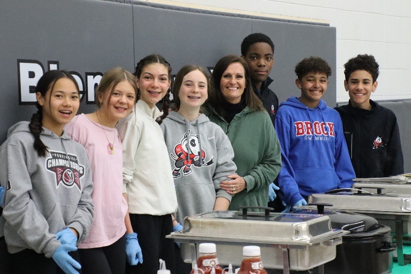

Les bénévoles du Griffon accueillaient la communauté francophone de St. Catharines au déjeuner de la francophonie le jeudi 23 mars à l’école Immaculée. Dès 6h30 le matin, les bénévoles étaient à l’œuvre pour préparer le menu de la journée, jambon, fèves au lard, œufs brouillés, rôtis et des crêpes servies avec du bon sirop d’érable du nord de l’Ontario. La foule fut nombreuse pour cette rencontre qui mettait en vedette la semaine de la francophonie. Au fur à mesure à compter de 7h30, les gens se sont présentés au gymnase pour rejoindre les enfants qui étaient fous de joie. L’orchestre de l’école St. Jean-de-Brébeuf était en scène pour divertir les gens avec son répertoire de morceaux pour plaire à tous les goûts. La troupe de l’enseignant de musique, M. Frado était pleine d’énergie. En bref, il y avait de l’électricité dans l’air, c’était la fête!

Les enfants dansaient, les parents et les grands-parents étaient emballés, il n’y a pas un plus bel exemple que la communauté franco-ontarienne demeure vivante et vibrante. Les élèves du cycle intermédiaire s’occupaient du service du déjeuner sous le regard de la directrice de l’école qui ne pouvait être plus fière de ses étudiants. Le Griffon continue à investir ses ressources au sein des communautés francophones de Niagara pour permettre aux gens de tout âge de découvrir le riche héritage du patrimoine franco-ontarien.

N’oubliez pas de continuer à visiter le site web du Griffon pour vous tenir au courant des activités à venir.
