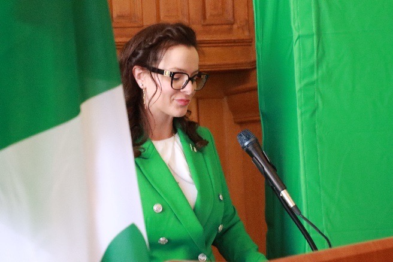
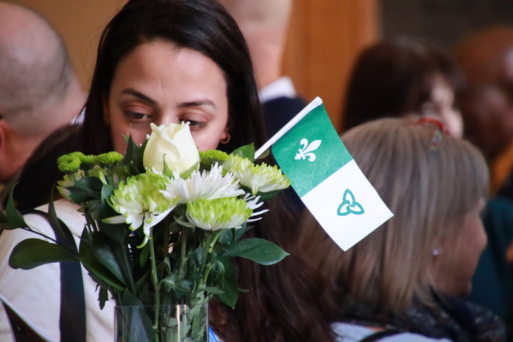

Fort impressionnée par les spectacles de l’orchestre de l’école St. Jean-de-Brébeuf au pavillon de la francophonie aux Jeux d’été du Canada, Natalia Kusendova, députée de l’Assemblée législative de l’Ontario ainsi que l'adjointe parlementaire de la ministre des Affaires francophones, invitait nos jeunes vedettes à participer à l’animation de la journée internationale de la francophonie à Queen’s Park. Il s’agit de tout un honneur pour nos jeunes artistes, en effet une véritable plume dans leurs chapeaux.

Ainsi, la troupe quitta l’école dès 7h le matin pour compléter la navette à Toronto. À titre d’invités de la députée, ils ont pris part à une tournée des lieux en plus d’être présentés dans la chambre pour ensuite prendre part à une session de photos avec la Ministre Mulroney. La cérémonie animée par la députée Kusendova se déroulait dans une salle comble. Pour commencer le tout, Mia Wendling interpréta un Oh Canada bilingue avec beaucoup de ferveur. Au programme, il y eu des allocutions de la Ministre Malroney, du Ministre de l’éducation Stephen Lecce, du Ministre des finances Peter Bethlenfalvy ainsi que de la députée Kusendova, une perle au sein du parti progressiste conservateur.

Fiers de leur identité franco-ontarienne, la troupe interpréta le chant Notre Place ainsi que Mon beau drapeau à une foule qui a su prendre avantage du moment pour renouer son appartenance à la collectivité francophone de l’Ontario. Comme pièce de résistance, Simon et Malcolm Hauber ont interprété plusieurs jigues de chez nous.

Les bénévoles du Griffon étaient évidemment emballés de contribuer au succès de cette belle cérémonie qui souligne l’importance de fait français en Ontario. L’investissement dans nos jeunes est la pierre angulaire de la francophonie du futur.
