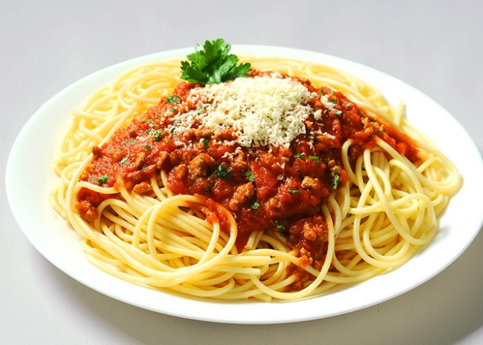
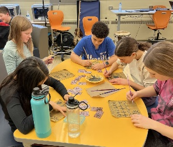

## Le vendredi 5 mai 2023

### De 17h à 20h au Centre Immaculée (101 rue Garnet à St. Catharines)

Le Griffon vous invite à un souper au spaghetti le vendredi 5 mai de 17h à 20h au Centre Immaculée au 101 rue Garnet à St. Catharines. Il s’agit d’un prélèvement de fond pour les voyages éducatifs. Les productions artistiques des élèves seront en exposition et disponible pour achat. Il y aura également un spectacle des talents des élèves. Venez en grands nombres à cette activité qui fait le rapprochement de nos jeunes à la communauté francophone de Niagara.

#### Adults - 15$
#### Enfants - 8$