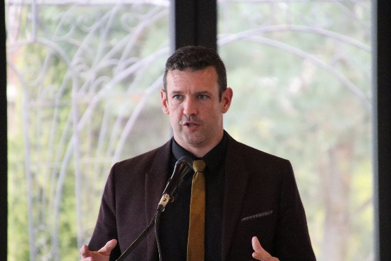

import {Carousel} from "react-bootstrap";

<Carousel className="mb-5 bg-black">
<Carousel.Item>

</Carousel.Item>
<Carousel.Item>

</Carousel.Item>
<Carousel.Item>

</Carousel.Item>
<Carousel.Item>

</Carousel.Item>
<Carousel.Item>

</Carousel.Item>
<Carousel.Item>

</Carousel.Item>
<Carousel.Item>

</Carousel.Item>
<Carousel.Item>

</Carousel.Item>
<Carousel.Item>

</Carousel.Item>
<Carousel.Item>

</Carousel.Item>
</Carousel>

Le bal des ambassadeurs du jeudi 4 mai qui a eu lieu au Club Roma marquait le début du festival des arts populaires de Niagara qui est connu comme le plus ancien festival de ce genre au Canada. Il s’agit d’une soirée qui se réalise avec pompe et fanfare durant laquelle on met en vedette les ambassadeurs des 26 clubs ethniques communautaires de Niagara. La soirée du 4 mai fut conçue comme une célébration des diversités culturelles de Niagara imprégnées de richesses et de talents de tous genres. Mia Wendling, l’ambassadrice des francophones de 2022 faisait partie du défilé ainsi qu’Arielle Wendling, l’ambassadrice des francophones de 2019 en plus d’être couronnée comme la dernière ambassadrice du festival comme tel.

Les organisateurs de la soirée ont tenu à garder les discours au minimum afin que les gens puissent jouir du programme chargé d’artistes variés. Dès leur entrée à la salle, les participants pouvaient jouir de la musique irlandaise présentées par Declan O’Sullivan, un chansonnier et musicien irlandais talentueux de la péninsule du Niagara. La prestation fut fort appréciée par la foule.

Durant le souper, Jennie Stevens, députée provinciale de St. Catharines a présenté ses salutations à la foule en plus de souligner l’importance de la célébration du patrimoine multiculturel de Niagara par le biais du « Folk Arts Festival » .

Le maire de St. Catharines, Mat Siscoe, prit la parole à son tour pour souhaiter la bienvenue aux délégués des nombreux regroupements culturels présents à la soirée articulant la richesse du pot-pourri culturel de Niagara. Notre maire qui en passant s’exprime bien en français, était enthousiaste de parler du forum jeunesse qu’il planifie initier au mois de septembre.

Melinda Chartrand, la vice-présidente du Folk Arts Council, fut la prochaine à souhaiter la bienvenue aux gens de la part du conseil d’administration du centre multiculturel de St. Catharines. Dans son allocution, elle présenta un bref aperçu de la panoplie des services offerts aux nouveaux-arrivants par le centre d’accueil. Le centre a grandement élargi son programme qui accueille de nombreux immigrants à tous les jours. Il est à noter que 30% de la clientèle s’identifie comme francophone.

La dernière allocution de la soirée fut présentée par Arielle Wendling , la dernière ambassadrice du festival qui remonte à 2019 en raison de la COVID. Étudiante en sciences de la santé à l’Université Laurentienne à Sudbury, Arielle a partagé avec la foule, la richesse de l’expérience qu’elle a vécue à titre d’ambassadrice en plus de leur offrir quelques conseils. Selon Arielle, il est important de jouir de chaque minute de l’expérience à titre de représentant/te de sa communauté, de saisir chaque occasion pour découvrir les joyaux de chaque groupe culturel et avant tout d’être une personne authentique. Ce passage permet à chaque ambassadeur de s’épanouir et de développer les compétences nécessaires à interagir avec le public, à prendre la parole et à resauter, chacune, des compétences qui mènent au succès dans le monde du travail.

Le reste de la soirée fut dédié au divertissement. Denis Simoneau a soulevé la foule en callant quelques danses canadiennes françaises animées par Simon Hauber au violon et son frère Malcolm au piano. La foule a tapé du pied en dansant queques jigs et des reels.

La troupe de danse Ethiopienne a également emballée la foule à prendre la piste de danse avec des morceaux dynamiques et des mouvements artistiques. Les costumes colorés des danseurs ont contribué à la beauté du spectacle.

Comme pièce de résistance, la troupe d’acrobaties aériennes, Femmes de feu, présentait le dernier spectacle de la soirée. La foule était pleinement engagée par la présentation des nombreux mouvements acrobatiques aux routines des jeunes prodiges mis en vedette par Holly Treddenick. Il s’agit d’un programme de formation pour les jeunes qui désirent développer des compétences dans ce domaine, qui intègre la gymnastique, la chorégraphie et l’acrobatie aérien. Suspendue sur un trépied de 6 mètres, les jeunes vedettes de 6 à 12 ans ont émerveillées la foule par leurs prouesses. Il est à noter que la troupe de 5 gymnastes étaient des jeunes francophones de Welland.

Le programme de la soirée se termina vers 22 heures. Les organisateurs ont évidemment élevé la barre du succès avec la réalisation du bal 2023. Ce sera un défi de taille pour les réalisateurs du programme 2024 à surpasser la réalisation du 4 mai dernier.

Les bénévoles du Griffon étaient évidemment emballés de contribuer au succès de cette belle soirée qui souligne l’importance de la diversité culturelle. Le Griffon demeure pleinement impliqué dans la réalisation de soirées culturelles avec une multitude de partenaires et un voix importante des francophones de la péninsule du Niagara.