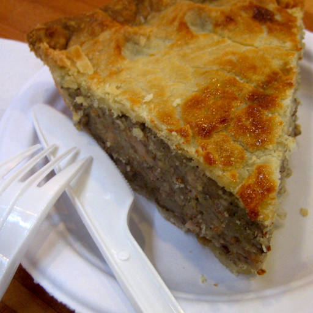
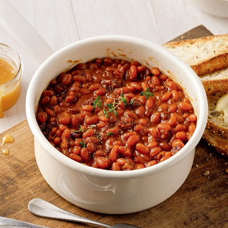
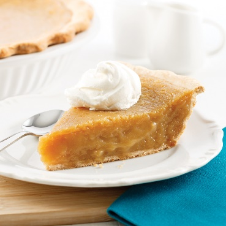

import Patrimoine from "../../../../components/Patriomoine";

En lien avec le <a href="https://niagarafolkartsfestival.ca/festival/home/2023-open-houses/club-lasalle/" target="_blank">Niagara Folk Arts Festival</a>, le Club LaSalle ouvre ses portes pour une soirée de danse et de musique.

### Le vendredi 5 mai 2023

#### De 17h à 22h au Club LaSalle (111 rue Arthur, St. Catharines)

### Souper canadiens français à compter de 17h
- Tourtière
- Ragout au lard avec des boulettes
- fèves au lard
- patates
- salade aux choux
- petits pains
- soupe aux poids
- tarte au sucre et au raisin
- Fudge par Monique

## Billets
- **Adults - 15$**
- **Enfants - 8$**

## Spectacle
- Gilles Groleau et son groupe présente un répertoire de musique française
- Simon et Malcolm Hauber présentent des jigs et des reels avec Denis Simoneau

<Patrimoine />