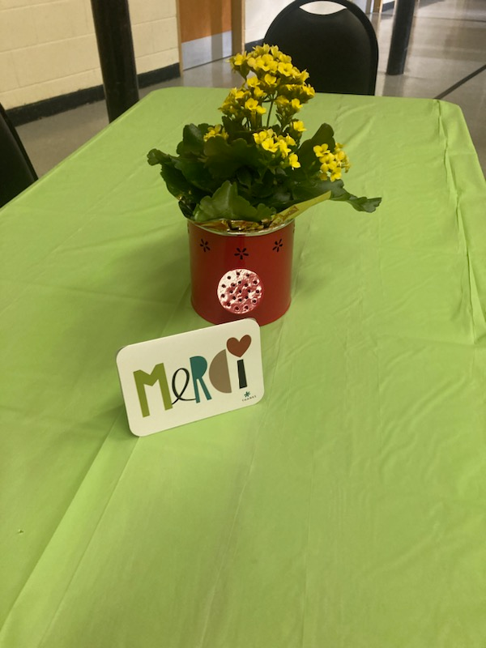
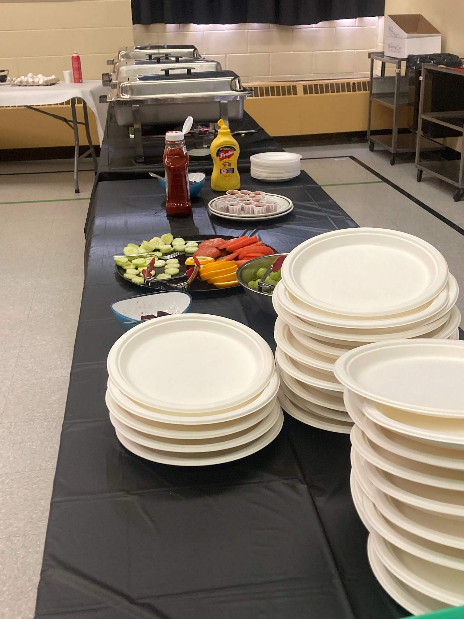
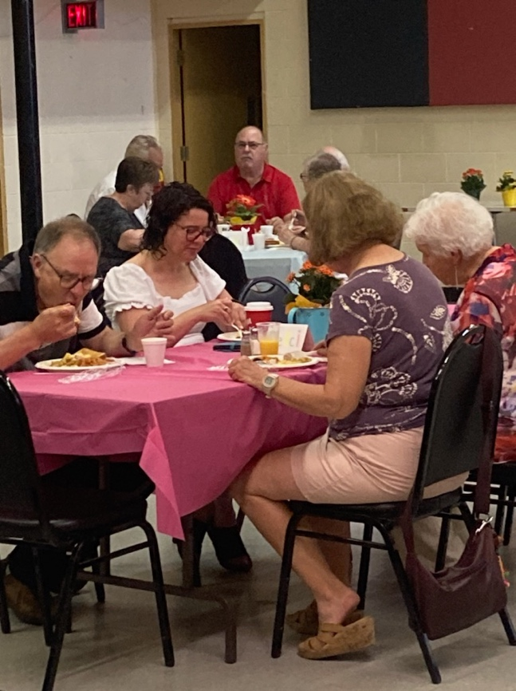

Le Griffon accueillait les bénévoles de la communauté au Centre Immaculée, pour déjeuner le dimanche 25 juin dernier. Au menu il y avait du jambon, des saucisses, des fèves au lard, des patates grillées, des rôtis, des fruits et des œufs cuis à la carte. Les gens étaient contents de se réunir pour jouir d’un bon déjeuner tout en partageant des histoires au sujet de nos accomplissements de l’année.

La communauté francophone de Niagara est étroitement tissée de gens d’un peu partout qui collaborent à la vitalité de la collectivité franco-ontarienne de notre région. Ce travail d’équipe est fondamental à l’essor de la francophonie régionale. À tous nos bénévoles, nous disons merci, votre investissement fait toute une différence. Vous faites partie des piliers de notre communauté qui portent avec fierté le flambeau qui nous a été légué par les fondateurs de notre communauté.
