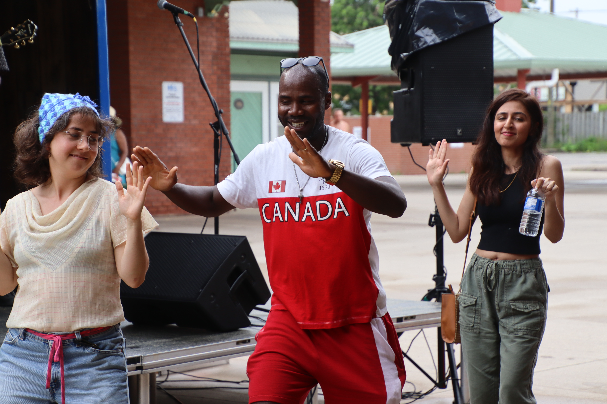
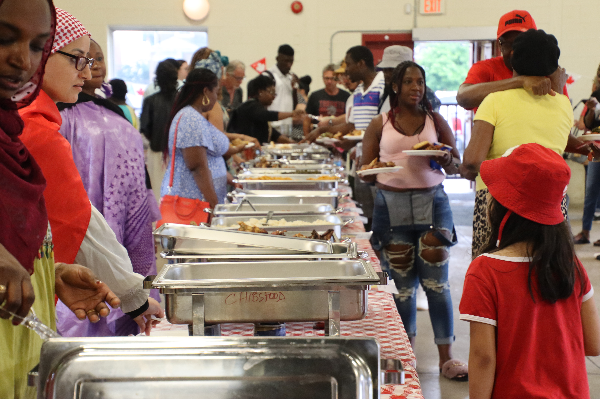
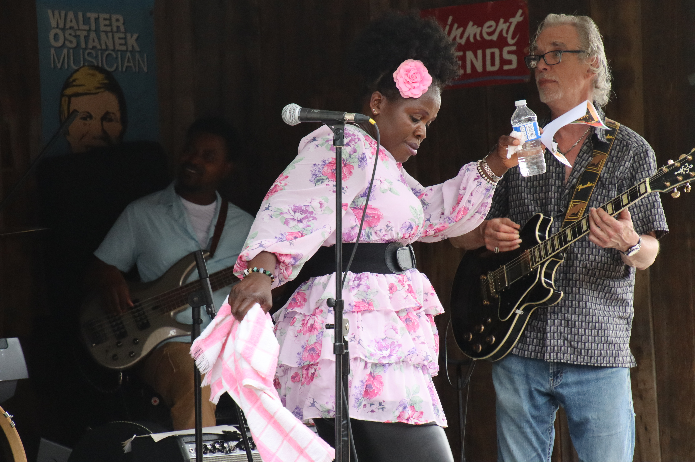

import {Carousel} from "react-bootstrap"

<Carousel className="mb-5 bg-black">
<Carousel.Item>

</Carousel.Item>
<Carousel.Item>

</Carousel.Item>
<Carousel.Item>

</Carousel.Item>
<Carousel.Item>

</Carousel.Item>
<Carousel.Item>

</Carousel.Item>
<Carousel.Item>

</Carousel.Item>
<Carousel.Item>

</Carousel.Item>
<Carousel.Item>

</Carousel.Item>
<Carousel.Item>

</Carousel.Item>
<Carousel.Item>

</Carousel.Item>
<Carousel.Item>

</Carousel.Item>
<Carousel.Item>

</Carousel.Item>
</Carousel>

SOFIFRAN en collaboration avec les bénévoles du Griffon invitaient la communauté du Niagara à la fête du Canada au marché à Welland samedi dernier. Le programme prévu pour la journée mettait en vedette Justine Gogoa une artiste bien connue sur le réseau franco-ontarien, Hervé Militi, ainsi que Danny Love Drum un groupe haïtien de Toronto. Sur les lieux se trouvaient une roulotte transformée en estrade portatif, gracieuseté du Niagara Artists Centre de St, Catharines pour mettre les artistes en vedette. Comme cachet tout à fait spécial, il s’agissait d’une fête soulignant la diversité culturelle du Canada, un véritable pot-pourri de la francophonie mondiale. Pour l’occasion, les bénévoles de SOFIFRAN ont préparé un buffet internationale offrant une variété de pièces de résistance des caraïbes et de divers pays de l’Afrique. Les gens ont évidemment joui de ce repas gastronomique pour tous les goûts.

Il va sans dire qu’il s’agissait d’une fête à un tempo très élevé. Tout au long de l’après midi et de la soirée, la foule fut entrainé à une variété de danses de diverses cultures, tantôt des danses caribéennes, tantôt des danses africaines au rythme de divers tambours. Dans peu de temps, les gens se sont embarqués dans la célébration aux sons rythmiques de ces artistes talentueux, avec l’accompagnement de Justine et d’Hervé.

Le maire de Welland, Frank Campion était passage pour souhaiter la bienvenue à la foule de la part de la mairie ainsi que Vance Badaway, le député fédéral de la région.

Malgré la pluie, les gens se sont déplacés en grands nombres pour célébrer la fête du Canada, tous heureux de vivre dans ce beau pays!
