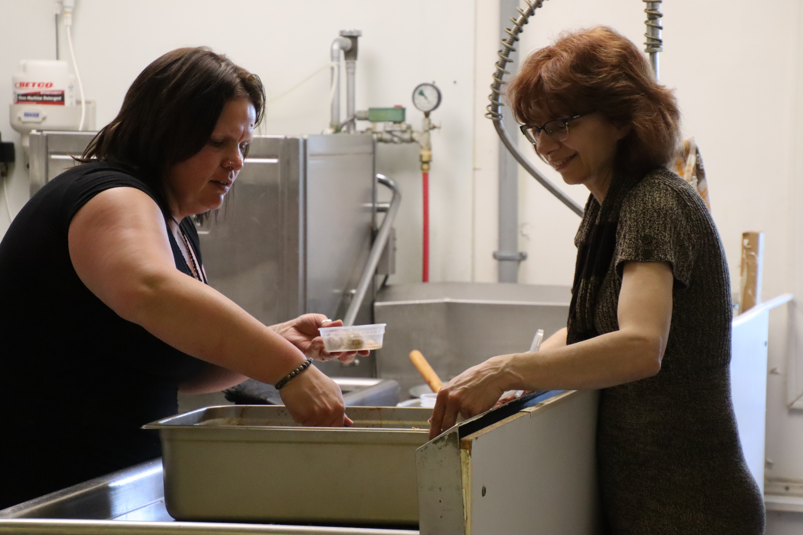
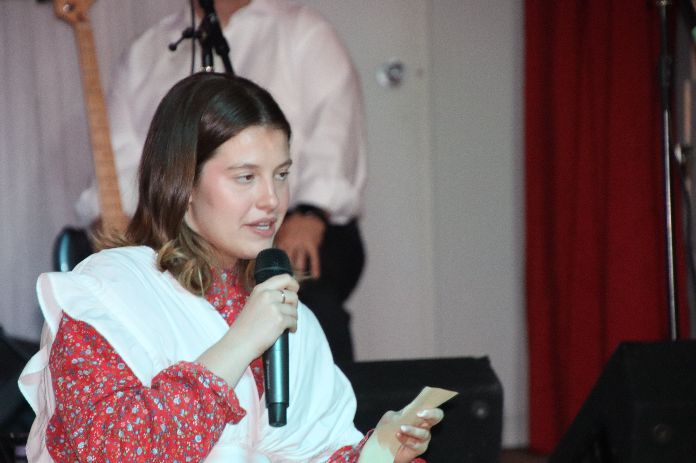

import Patrimoine from "../../../../components/Patriomoine"
import {Carousel} from "react-bootstrap"

<Carousel className="mb-5 bg-black">
<Carousel.Item>

</Carousel.Item>
<Carousel.Item>

</Carousel.Item>
<Carousel.Item>

</Carousel.Item>
<Carousel.Item>

</Carousel.Item>
<Carousel.Item>

</Carousel.Item>
<Carousel.Item>

</Carousel.Item>
<Carousel.Item>

</Carousel.Item>
<Carousel.Item>

</Carousel.Item>
<Carousel.Item>

</Carousel.Item>
<Carousel.Item>

</Carousel.Item>
<Carousel.Item>

</Carousel.Item>
<Carousel.Item>

</Carousel.Item>
<Carousel.Item>

</Carousel.Item>
<Carousel.Item>

</Carousel.Item>
<Carousel.Item>

</Carousel.Item>
<Carousel.Item>

</Carousel.Item>
<Carousel.Item>

</Carousel.Item>
<Carousel.Item>

</Carousel.Item>
<Carousel.Item>

</Carousel.Item>
<Carousel.Item>

</Carousel.Item>
<Carousel.Item>

</Carousel.Item>
<Carousel.Item>

</Carousel.Item>
<Carousel.Item>

</Carousel.Item>
</Carousel>

Les bénévoles du Griffon et du Club La Salle accueillaient la communauté du Niagara à la porte ouverte des francophones le 26 mai dans le cadre du « Niagara Folk Arts Festival ». Le comité organisateur était à l’œuvre pendant plusieurs jours avant le festin à préparer le repas, puisqu’il s’agissait d’une activité majeure au calendrier annuel du Griffon. Il va s’en dire que l’équipe n’a pas été déçu du résultat en accueillant une foule de 300 convives qui s’étaient rassemblés pour cette soirée traditionnelle. Au menu, la cuisine offrait de la tourtière, du ragoût avec des boulettes, des fèves au lard, des patates, de la salade aux choux, de la soupe aux pois et un petit pain. Toujours soucieux d’offrir un repas digne de la tradition canadienne française, les cuisiniers étaient très heureux de voir les participants raffoler de ce repas gastronomique. De dire les convives, « ce repas est bon en … titi »

Il faut rendre hommage à l’équipe de la cuisine, Monique Richardson, Alice Lebel, Linda Lavoie, Micheline Belleau ainsi qu’aux bénévoles Roseanne Wendling et ses filles, Mia, Kyera, Justine et Arielle, Germain Gauthier et Alain Fournier. L’équipe comptait également l’ambassadeur du Club La Salle, Jeffrey Bell et sa mère.

Tel le veut la tradition, le Club accueillait les ambassadeurs pour la soirée. Afin de leur faire découvrir un goût de notre héritage, le Griffon invitait Denis Simoneau pour animer une clinique de rythme à la cuillère. Ainsi, Simon et Malcolm Hauber ont joué le reel de Ti-clin tandis que les ambassadeurs accompagnaient à la cuillère. Denis a suivi à avec une courte clinique à faire danser le petit bonhomme jigueur. Simon et Malcolm ont ensuite joué le reel de Ste-Anne. Les ambassadeurs ce sont amuser comme des petits fous à faire danser le petit bonhomme. Les accompagnateurs des ambassadeurs ce sont tous et toutes dirigés vers la piste de danse pour prendre des photos et des vidéos. De dire la coordonnatrice du festival, « comme c’est original, c’est sans doute l’activité la plus amusante à laquelle les ambassadeurs ont participé durant le festival »! De plus certains ambassadeurs étaient très habiles à fort stepper le petit bonhomme. En bref, la foule fut impressionnée.

La soirée fut ensuite présentée comme un party de cuisine. L’animateur expliqua que chez les canadiens français, les familles se rencontraient à l’été et dans le temps des fêtes pour célébrer. Les enfants mangeaient en premier ensuite les grands-parents et les aînés et ensuite le reste de la famille. Les petits s’assoyaient dans les escaliers pour observer les adultes interpréter des chants folkloriques du patrimoine canadiens français, danser et boire un petit whisky suivi d’une bière. L’orchestre sous la direction de Gilles Groleau, accompagnée par Michelène Hauber et Carole Anderson était au sommet de son art. Pendant plus de 2 heures, les gens ont dansé au rythme de l’orchestre. Denis Simoneau a callé quelques sets carrés au plaisir de la foule.

La porte ouverte des francophones du 26 mai fut parmi les plus grands succès Du Griffon et du Club La Salle. La foule et les organisateurs du festival se sont bien amusés durant notre 5 à 9. Malgré que les bénévoles étaient épuisés, tous et toutes se réjouissaient avec cet énorme succès.

Pour le repas, il faut souligner que Monique, Alice et Linda ont préparé de la pâte pour produire 175 tartes, quel labeur! En tout l’équipe de la cuisine a produit 65 tourtières, 100 tartes aux raisins et au sucre, 30 livres de fudge, 30 livres de fèves au lard, 140 livres de patates, 950 boulettes, 80 livres de ragoût, 3 grosses marmites de soupe aux pois. Il s’agissait de toute une corvée qui en a pleinement valu la peine.

Ces grandes soirées sont possible grâce au dévouement de ces bénévoles de la communauté francophone, sans qui rien ne serait possible. Il faut leur rendre hommage.

Les bénévoles du Griffon étaient évidemment emballés de contribuer au succès de cette belle soirée qui souligne l’importance de la collectivité franco-ontarienne. Le Griffon demeure pleinement impliqué dans la réalisation de soirées culturelles avec ses nombreux partenaires et demeure sans question, une voix importante de la communauté francophone de la péninsule du Niagara.

<Patrimoine />
