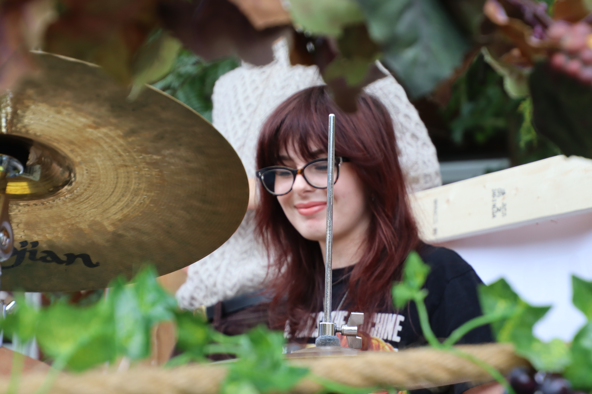
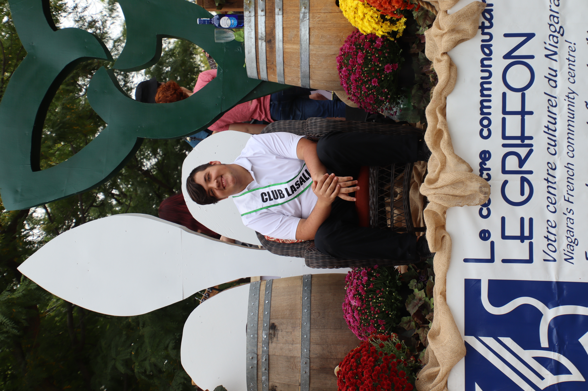
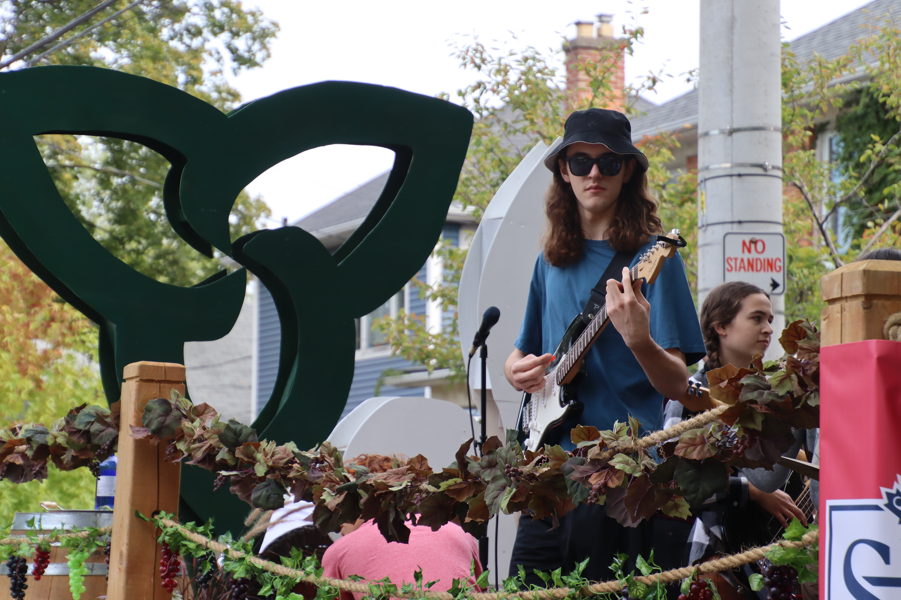
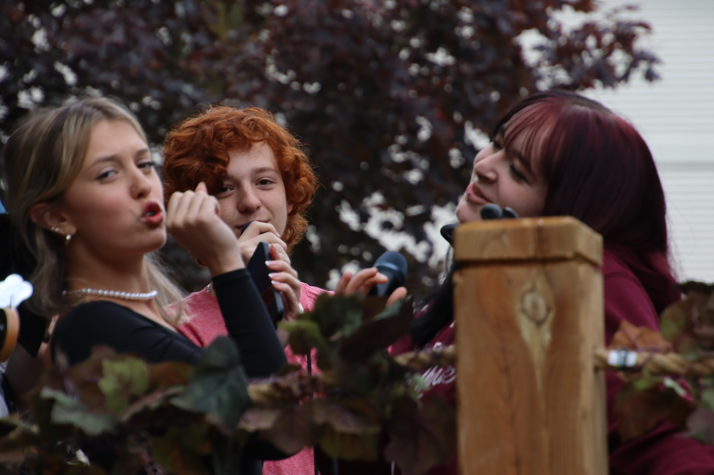

import {Carousel} from "react-bootstrap"
import Patrimoine from "../../../../components/Patriomoine"

<Carousel className="mb-5">
<Carousel.Item>

</Carousel.Item>
<Carousel.Item>

</Carousel.Item>
<Carousel.Item>

</Carousel.Item>
<Carousel.Item>

</Carousel.Item>
<Carousel.Item>

</Carousel.Item>
<Carousel.Item>

</Carousel.Item>
<Carousel.Item>

</Carousel.Item>
<Carousel.Item>

</Carousel.Item>
<Carousel.Item>

</Carousel.Item>
<Carousel.Item>

</Carousel.Item>
<Carousel.Item>

</Carousel.Item>
<Carousel.Item>

</Carousel.Item>
<Carousel.Item>

</Carousel.Item>
<Carousel.Item>

</Carousel.Item>
<Carousel.Item>

</Carousel.Item>
<Carousel.Item>

</Carousel.Item>
<Carousel.Item>

</Carousel.Item>
</Carousel>

Mené par le porteur du drapeau franco-ontarien, le char allégorique de la communauté francophone de Niagara affichait ses couleurs avec pompe et fanfare dans la « Grande Parade du Niagara Grape and Wine Festival », le samedi 23 septembre. Le Griffon présente un char dans la parade depuis 1999 comme témoignage de la vitalité de la communauté francophone de Niagara. Fidèles à leur tradition, les bénévoles du Griffon ont investis de nombreuses heures à préparer un montage dont les partenaires communautaires peuvent être fiers. Garni de l’emblème franco-ontarien, des bannières de ses partenaires, d’un montage de fleurs, les spectateurs démontraient leur appréciation pour la présentation artistique de notre cortège. L’ambassadeur du Club La Salle, Jeffrey Bell, était également en vedette. Le char n’est jamais complet sans l’orchestre de Brébeuf qui a présenté un répertoire de chansons populaires qui ont soulevé les gens au passage. En effet, c’était « le party », la troupe était « hot ».  La mascotte de l’école, Léo saluait les petits et les grands tout au long du trajet. Mme Wendling, la directrice de l’école Immaculée et ses élèves, super excités de faire partie de la parade faisaient partie de la délégation de francophones fiers d’être les ambassadeurs de notre communauté.

Tout au long de l’année, les bénévoles du Griffon assurent une présence francophone dans les événements culturels régionaux d’envergure. À titre de moteur culturel de la péninsule, l’équipe du Griffon n’a jamais le temps de s’ennuyer. Enfin, il est important de souligner que le travail communautaire du Griffon serait impossible sans l’appui financier de Patrimoine Canada. Consulter notre site web pour vous renseigner sur les activités à venir.

<Patrimoine />