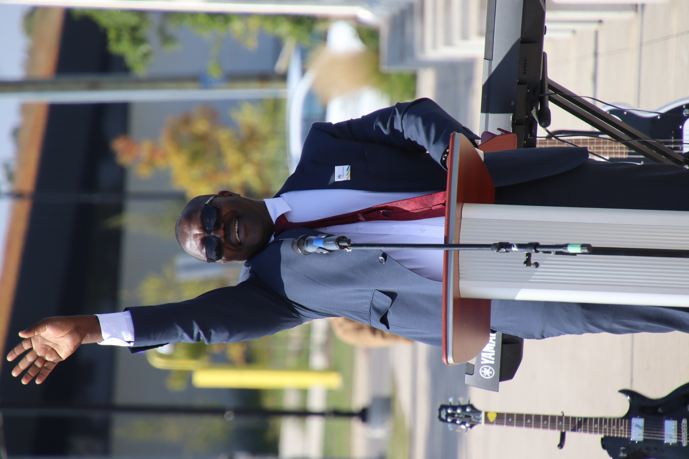
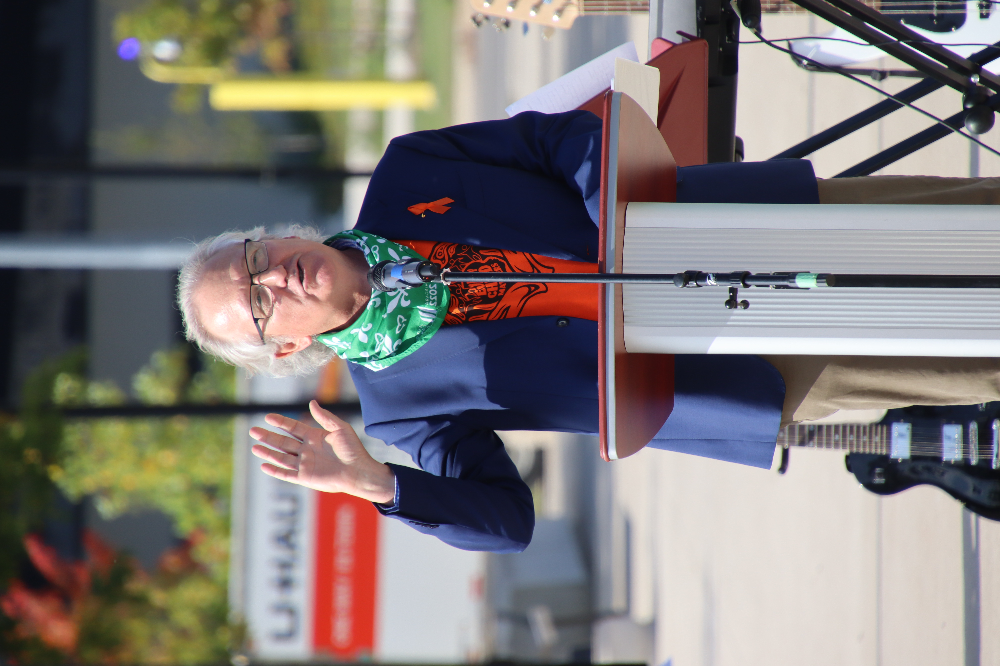

import {Carousel} from "react-bootstrap"
import Patrimoine from "../../../../components/Patriomoine"

<Carousel className="mb-4">
<Carousel.Item>

</Carousel.Item>
<Carousel.Item>

</Carousel.Item>
<Carousel.Item>

</Carousel.Item>
<Carousel.Item>

</Carousel.Item>
<Carousel.Item>

</Carousel.Item>
<Carousel.Item>

</Carousel.Item>
<Carousel.Item>

</Carousel.Item>
<Carousel.Item>

</Carousel.Item>
<Carousel.Item>

</Carousel.Item>
<Carousel.Item>

</Carousel.Item>
<Carousel.Item>

</Carousel.Item>
<Carousel.Item>

</Carousel.Item>
<Carousel.Item>

</Carousel.Item>
<Carousel.Item>

</Carousel.Item>
<Carousel.Item>

</Carousel.Item>
<Carousel.Item>

</Carousel.Item>
<Carousel.Item>

</Carousel.Item>
<Carousel.Item>

</Carousel.Item>
<Carousel.Item>

</Carousel.Item>
</Carousel>

Suite au succès de la levée du drapeau franco-ontarien aux bureaux de la municipalité régionale de Niagara de l’an dernier, Susan Morin, la gestionnaire du développement économique communautaire de la ville de Thorold lançait de nouveau l’invitation aux écoles de la région de se regrouper le 25 septembre dernier pour ce grand événement qui célèbre la francophonie ontarienne.

Les écoles ont certainement répondu à l’appel puisque cette année, la foule dépassait 500 élèves tous et toutes jubilants(es) pour cette célébration qui contribue à la construction identitaire de notre jeunesse. La troupe musicale de l’école secondaire Franco Niagara a lancé l’activité en interprétant quelques morceaux au plaisir de la foule. Évidemment, les élèves se sont investis à présenter un court répertoire qui mettait en vedette leurs talents artistiques. L’interlude musicale donnait place aux discours des invités dont M. Jim Bradley, président du bureau régional de la municipalité de Niagara, M. Frank Campion, maire de la ville de Welland, M. Terry Ugilini, maire de la ville de Thorold.

Il y avait de l’électricité dans l’air. La cérémonie animée par Susan Morin fut enrichi par des discours et des témoignages soulignant l’importance de l’événement pour la collectivité francophone du Niagara. L’orchestre de l’école St. Jean-de-Brébeuf ont suivi au programme en interprétant quelque chants qui sont chers aux franco-ontariens. Pour la levée, la foule a entamé notre hymne, « Je te chante mon drapeau » qui est devenu le symbole de la francophonie de l’Ontario. Il s’agit d’un moment qui soulève toujours le cœur des petits comme des grands !

Il faut souligner que les témoignages des élèves manifestant leur engagement à la collectivité franco-ontarienne fut le point culminant de la célébration !

Les bénévoles du Griffon étaient fiers de contribuer au succès de cette rencontre annuelle qui est un moment fort en émotions et un témoignage de l’importance de notre jeunesse dans la relève des chefs de file du présent. Enfin, le Griffon peut réaliser ces événements grâce au financement de Patrimoine Canada.

<Patrimoine />