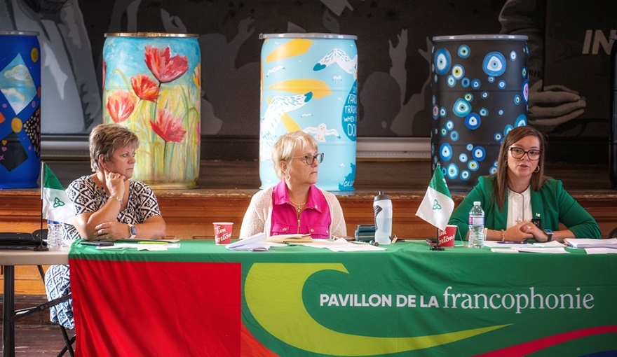

Les membres de la Table de l’interagence du Niagara accueillaient avec joie, Mme Natalia Kusendova, adjointe parlementaire à la Ministre des affaires francophones de l’Ontario le 16 mai dernier à sa réunion trimestrielle. Susan Morin, d’Entreprise Niagara et présidente du comité de l’interagence était ravi d’accueillir la député qui est bien connue pour son engagement à la francophonie de l’Ontario. La réunion permettait à la député de découvrir les nombreux volets des services francophones disponible dans la péninsule, tant du plan culturel, en santé, en accueil des nouveaux-arrivants, en service pour les ainés, en éducation, au plan économique, en tourisme, en effet, un peu de tout afin que les francophones puissent vivre en français à Niagara. Pour enrichir la discussion, le commissaire intérimaire aux services en français de l’Ontario, M. Carl Bouchard se joignaient aux groupes d’intervenants. Les 2 invités d’honneur ont été forts impressionnés par l’inventaire de services en français offerts à Niagara, surtout pour l’accueil des nouveaux-arrivants qui comptent plusieurs francophones. Chaque secteur a présenté ses programmes, ses succès ainsi que ses défis. M. Bouchard et Mme Kusendova ont affirmé que leurs portes sont toujours ouvertes pour contribuer au succès des initiatives en français en Ontario.

Le Griffon était fier de jouer un rôle important dans la réalisation de cette rencontre stratégique. Il va sans dire le que le réseau de contact établi par Melinda Chartrand joue un rôle clé dans la promotion de la francophonie de notre région. Le Griffon continue à s’illustrer comme l’organisme rassembleur des divers regroupements francophones de la péninsule ainsi que le premier contact auprès des organismes anglophones pour assurer la participation des francophones aux projets culturels d’envergure à Niagara. Tous les intervenants présents étaient d’accord que la réunion fut un énorme succès. Mme Kusendova affirma que le regroupement de l’interagence de Niagara, sa coordination, est l’exemple parfait d’un modèle de services efficaces. Il faut lever notre chapeau à Susan Morin qui le chef d’orchestre du regroupement, en principe le moteur qui fait avancer la machine.

