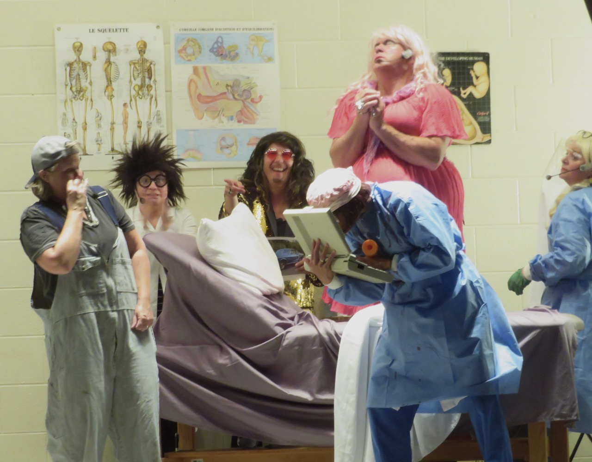

import {Carousel} from "react-bootstrap"

<Carousel className="mb-4">
<Carousel.Item>

</Carousel.Item>
<Carousel.Item>

</Carousel.Item>
<Carousel.Item>

</Carousel.Item>
</Carousel>

La troupe « Grouille ou Rouille » d’Earlton Ontario a présenté sa pièce, Clinique aux petits soins, le samedi 16 septembre dans la salle paroissiale de l’Église Immaculée-Conception à St Catharines. Cette comédie a su faire rire et rigoler les spectateurs et spectatrices venus de Hamilton, Welland, Niagara Falls et St Catharines. Il a fallu attendre jusqu’à la fin de la pièce avant de découvrir qui était le père du bébé de la charmante Rosélia jouée par Roch Loranger. Les trois suspects: Hillie Billie, Jean Peupu et Stud ont tremblés dans leurs bottes en attendant les résultats des tests de paternité. Pour savoir la vérité, demandez à un de vos amis qui a vu la pièce.

Le Club les Bons Vivants a fait venir cette troupe grâce à l’appui du Griffon, des Hommes Catholiques, des Chevaliers de Colomb, du Club Richelieu et Moesz Auto. Le Griffon collabore avec ses nombreux partenaires à offrir des spectacles en français dans la région du Niagara.

Prochainement, nous mettons en vedette avec le Club les Bons Vivants, Brigitte Leblanc, « la Gitane du Nord », le 20 octobre à 14h au centre Immaculée
