import Patrimoine from "../../../../components/Patriomoine";
import {Carousel} from "react-bootstrap";

<Carousel className="mb-4">
<Carousel.Item>

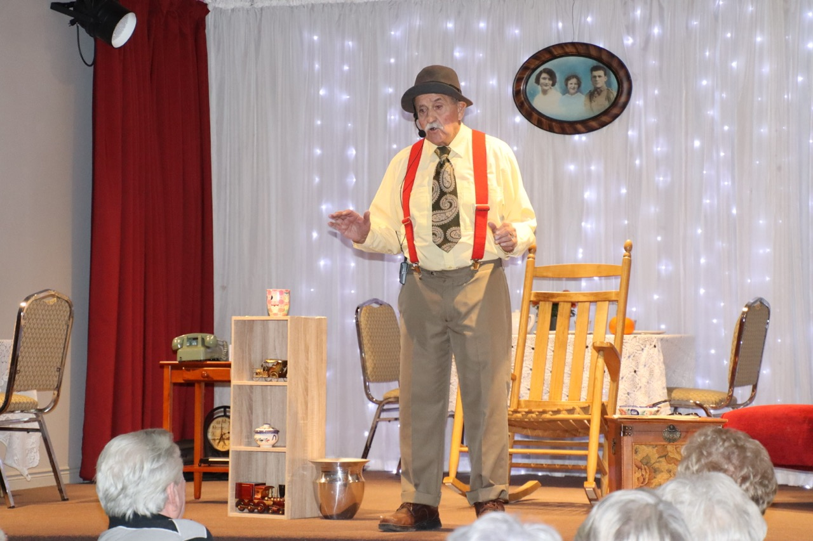
</Carousel.Item>
<Carousel.Item>

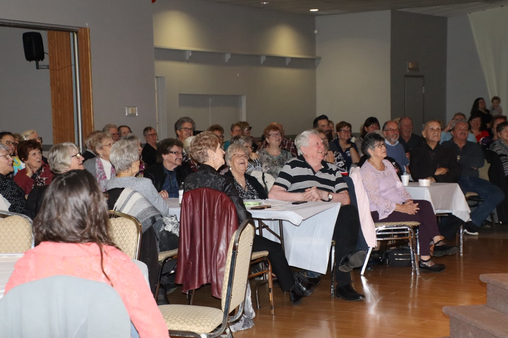
</Carousel.Item>
<Carousel.Item>

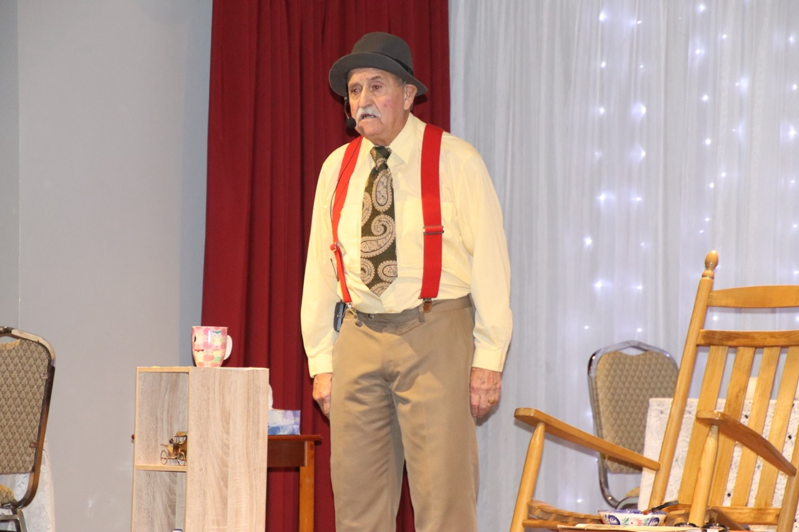
</Carousel.Item>
<Carousel.Item>

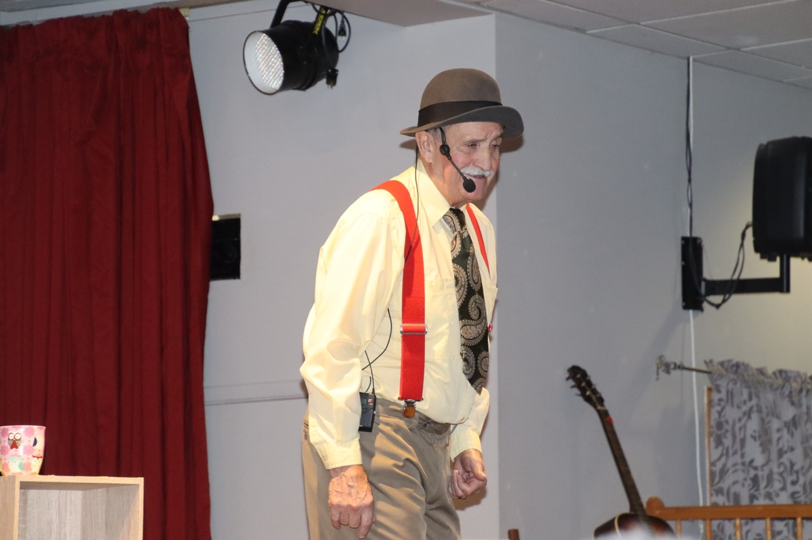
</Carousel.Item>
<Carousel.Item>

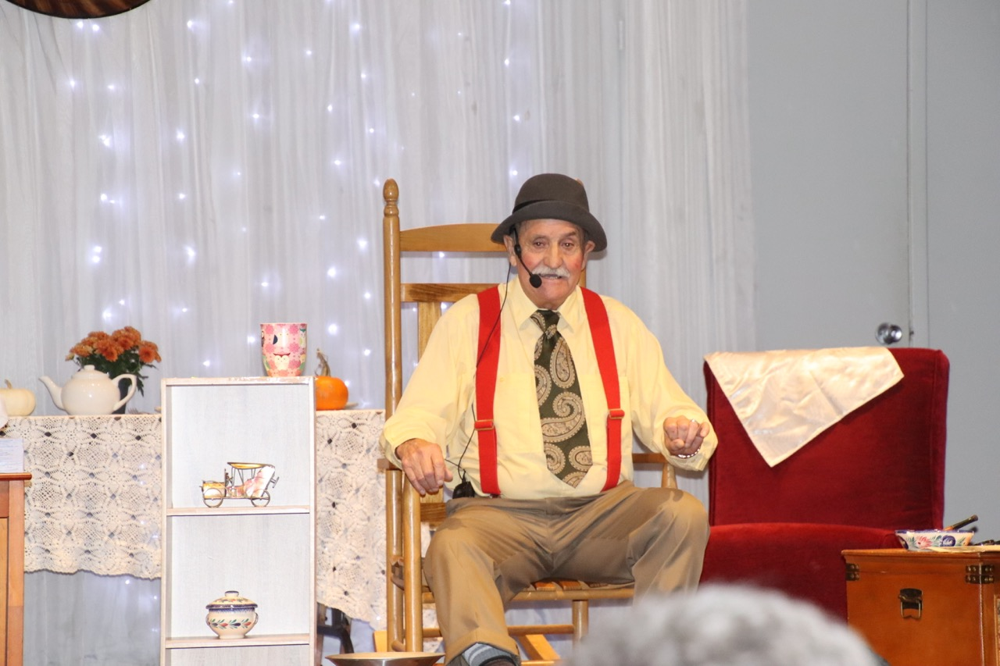
</Carousel.Item>
<Carousel.Item>

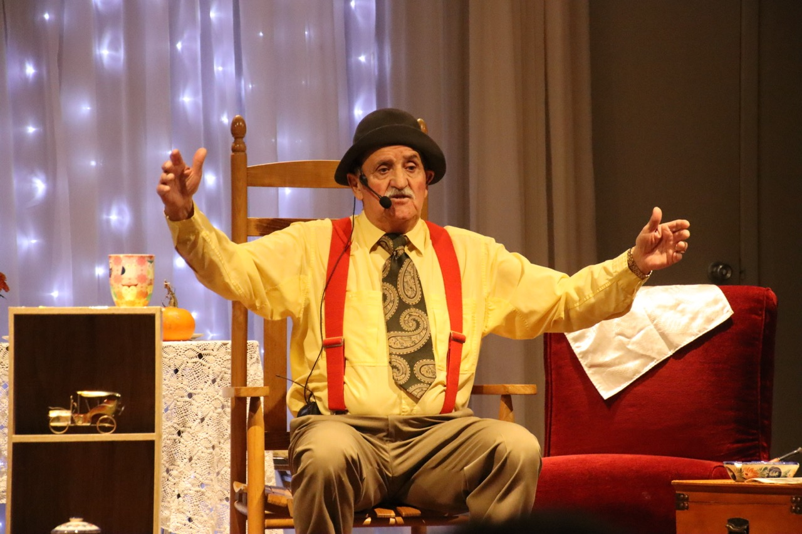
</Carousel.Item>
<Carousel.Item>

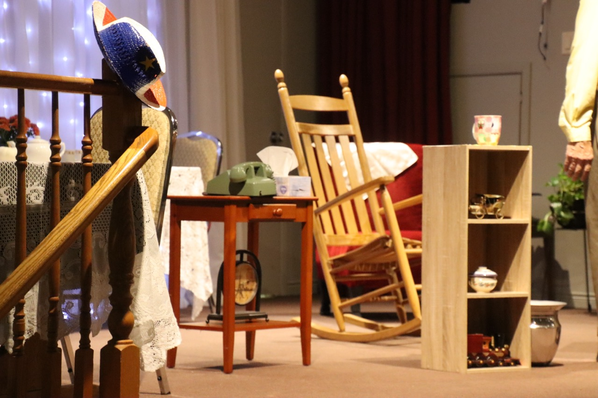
</Carousel.Item>
<Carousel.Item>

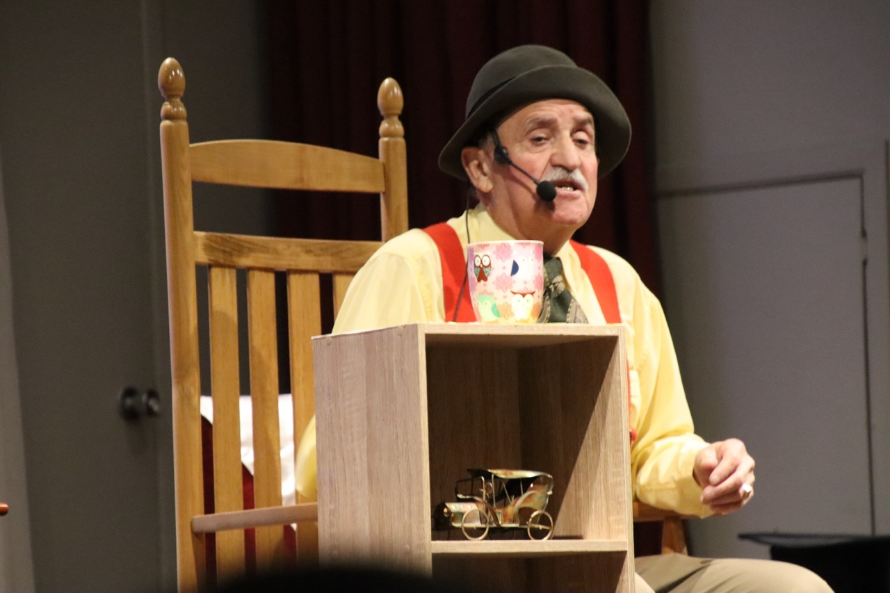
</Carousel.Item>
<Carousel.Item>

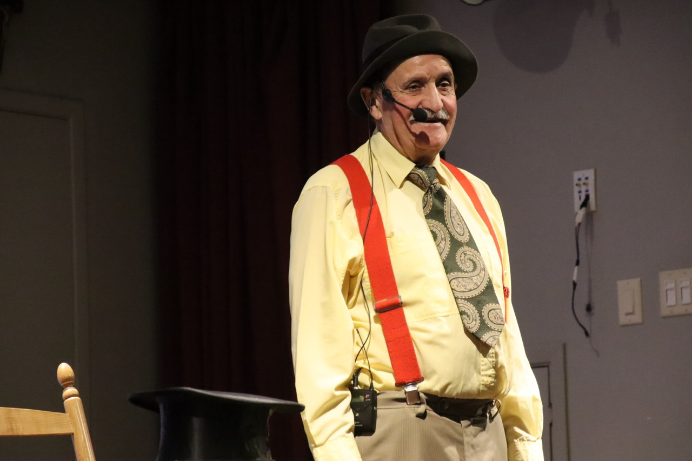
</Carousel.Item>
<Carousel.Item>

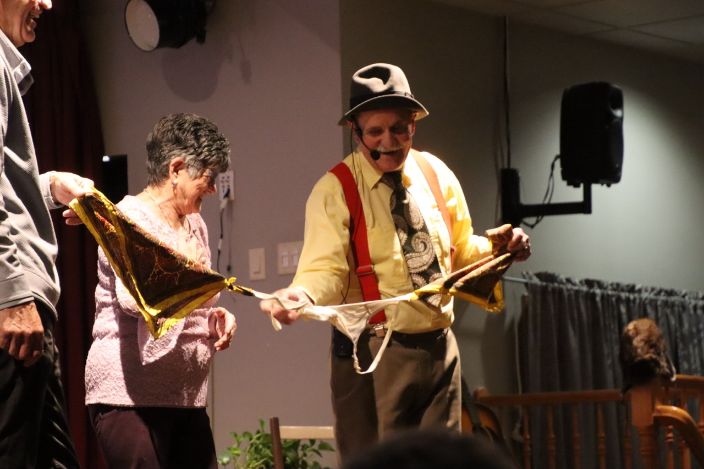
</Carousel.Item>
<Carousel.Item>

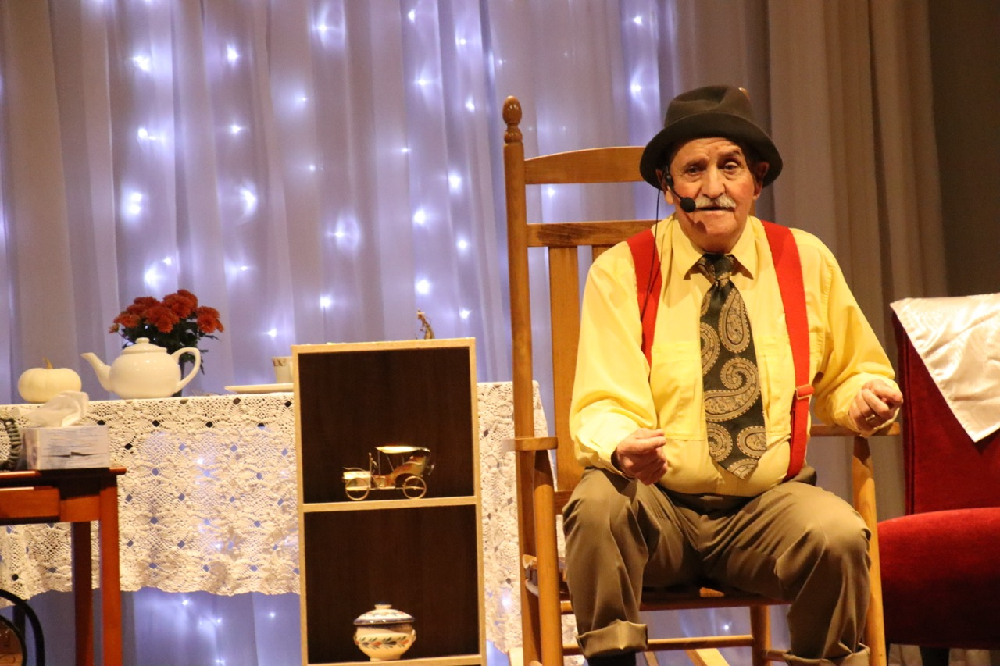
</Carousel.Item>
</Carousel>

Le Club La Salle en collaboration avec Le Griffon mettaient en vedette Jean Guy Chiasson dans son rôle « d’Antoine à Eustache » le dimanche 22 octobre. Une foule de plus de 130 amateurs de la comédie se rassemblaient au Club pour écouter aux histoires d’Antoine, qui est bien connu pour son sens d’humour et ses histoires farfelus.

Dès 17 heures, les gens sont venus au Club pour déguster un souper gastronomique au spaghetti digne d’un repas servi dans un bistro italien. Un peu de musique de fond acadienne, quelques verres et les convives étaient prêts pour une soirée de rires. Notre ami Jean-Guy étaient au sommet de son art !

De retour dans son petit village au pays des acadiens, Antoine nous raconta des histoires au sujet de sa nuit de noces, de sa jeunesse à Eustache, de ses visites au docteur et chez le dentiste. Pendant près de 2 heures, les gens étaient crampés de rire. Il s’agit d’une excellente source de thérapie pour les petits bobos de la vie.

À la fin du spectacle, tous et toutes étaient d’accord que les histoires d’Antoine à Eustache et les retrouvailles au Club La Salle font partie des événements que nous offrons qui contribuent à la vitalité de la communauté francophone de Niagara.

<Patrimoine />