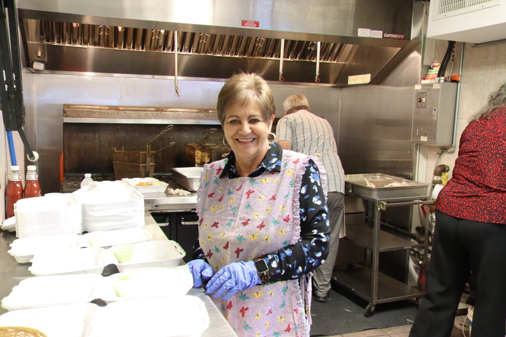
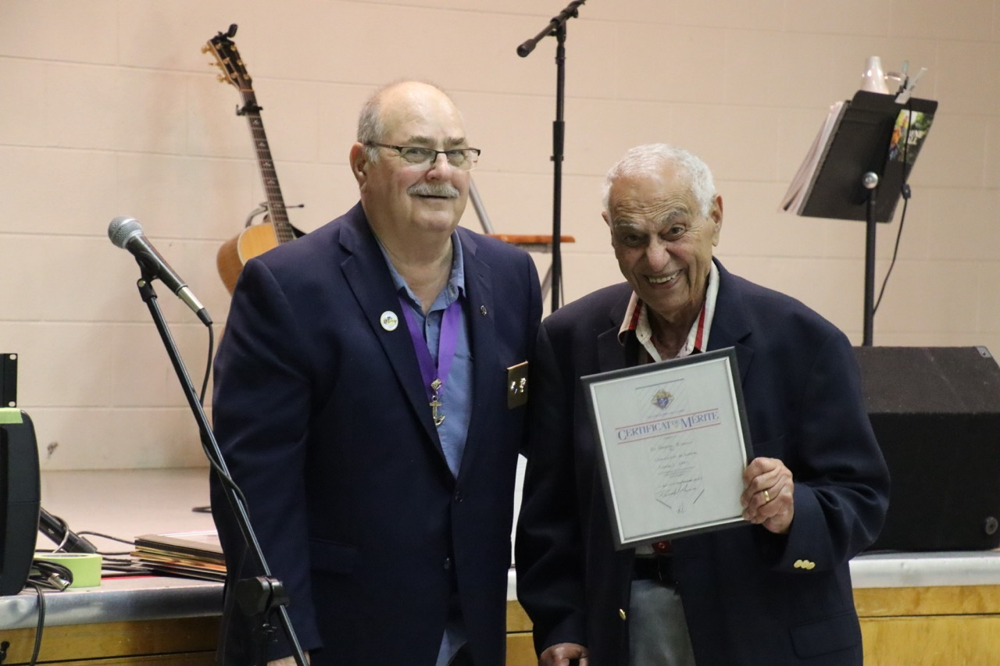
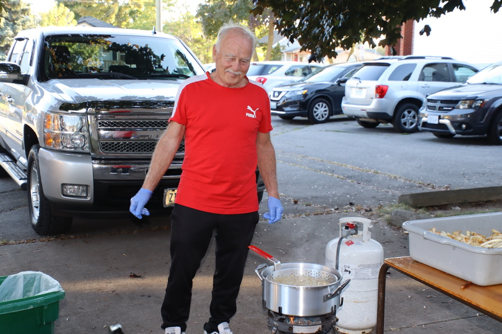
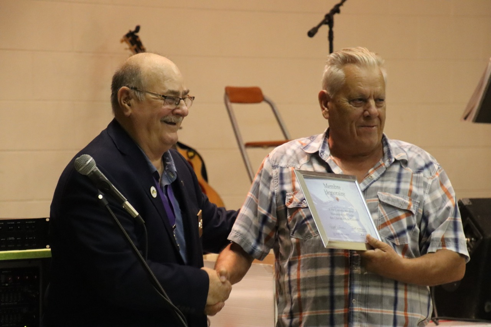
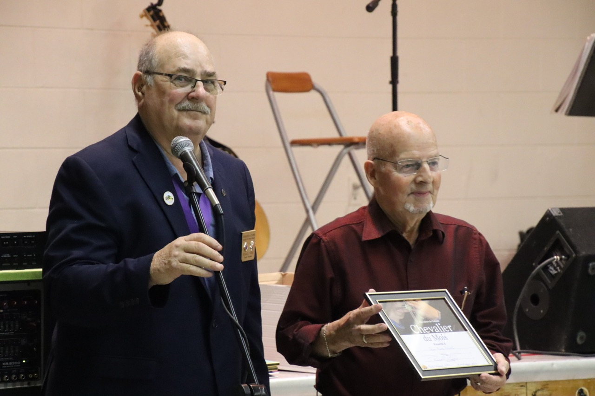
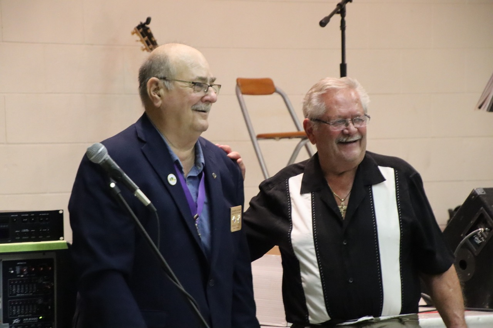
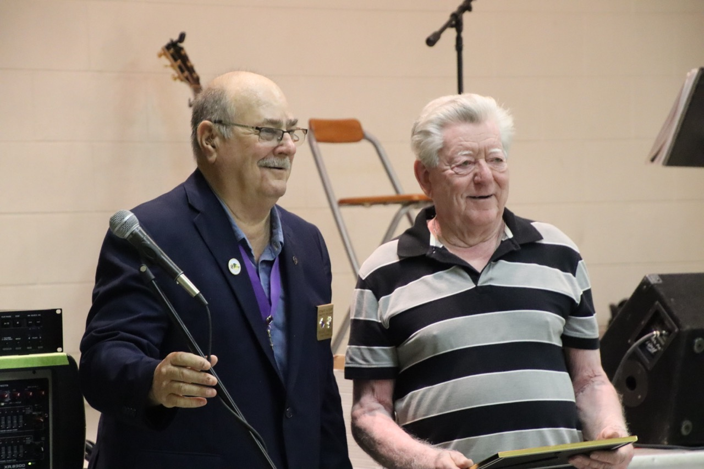
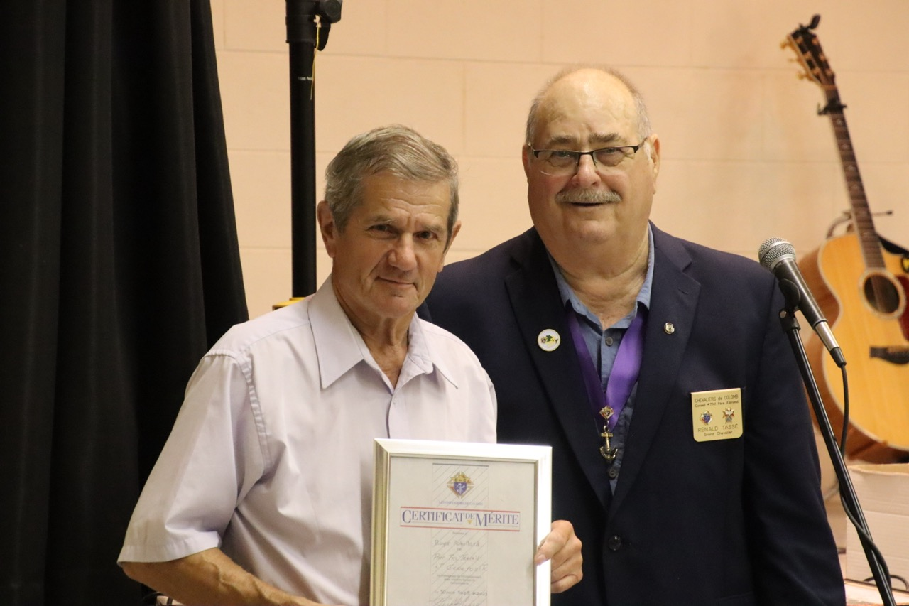
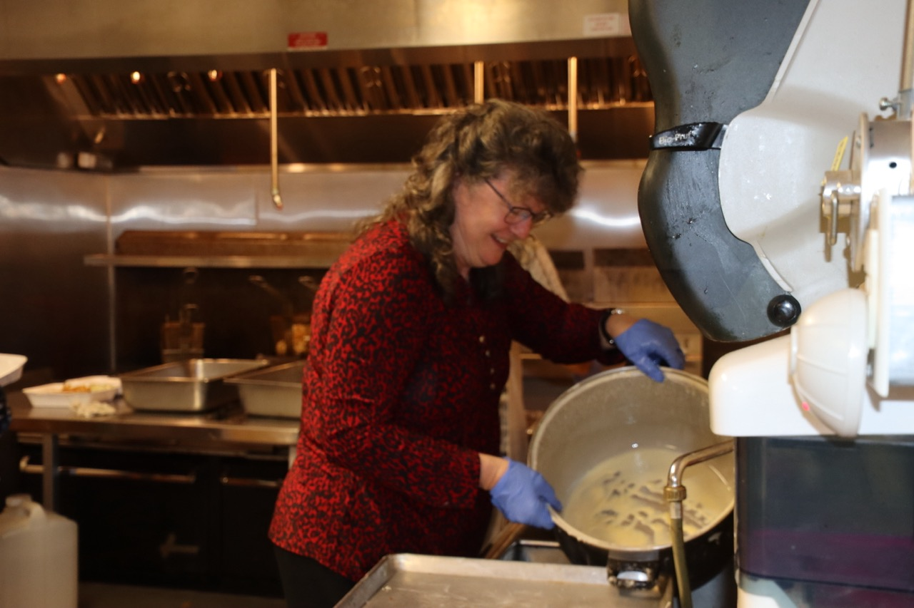

import {Carousel} from "react-bootstrap"

<Carousel className="mb-4">
<Carousel.Item>

</Carousel.Item>
<Carousel.Item>

</Carousel.Item>
<Carousel.Item>

</Carousel.Item>
<Carousel.Item>

</Carousel.Item>
<Carousel.Item>

</Carousel.Item>
<Carousel.Item>

</Carousel.Item>
<Carousel.Item>

</Carousel.Item>
<Carousel.Item>

</Carousel.Item>
<Carousel.Item>

</Carousel.Item>
<Carousel.Item>

</Carousel.Item>
</Carousel>

Comme le poisson est délicieux ! Ce commentaire fut le consensus de la foule de 150 amateurs des fruits de mers qui sont venus au Centre Immaculée pour notre souper communautaire à la morue le 30 septembre dernier. Ainsi, le Griffon en collaboration avec les Chevaliers parrainaient cette activité qui s’intègre à son programme culturel annuel. Luc Frigault fut à la hauteur de sa réputation comme chef en préparant une panure qui donnait au poisson ce goût particulier tant apprécié par les invités. Fidèles à leur engagement communautaire, les bénévoles des 2 organismes travaillaient côte à côte pour contribuer au succès de l’activité. Une rencontre franco-ontarienne n’est pas complète sans une soirée dansante. Celle-ci fut animée par Wayne Wall, un artiste bien apprécié par notre communauté.

À l’interlude, les Chevaliers ont reconnu plusieurs de leurs frères qui s’impliquent sans réserve à la vie communautaire de St. Catharines.

Le Griffon collabore avec ses nombreux partenaires à offrir une variété d’activités qui répondent aux intérêts variés des francophones de Niagara. Prochainement, les bénévoles du Griffon mettent en vedette « Antoine à Eustache » au Club La Salle le dimanche le dimanche 22 octobre; la soirée vin, fromage et encan en partenariat avec le Richelieu de Niagara Falls le samedi 11 novembre et le Noêl des petits au Club La Salle le dimanche 3 décembre.
