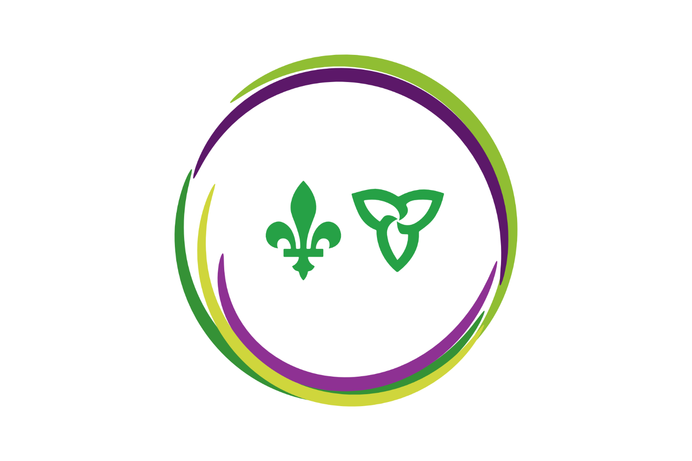
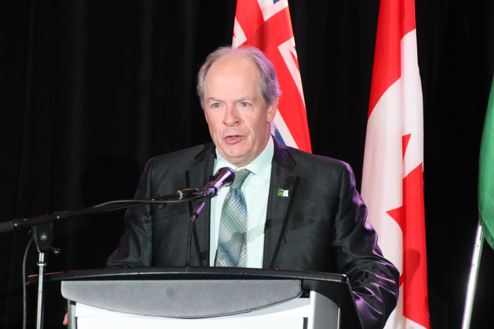
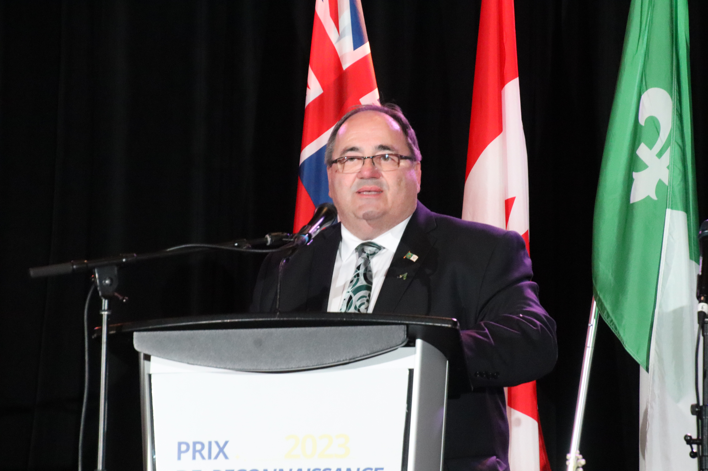
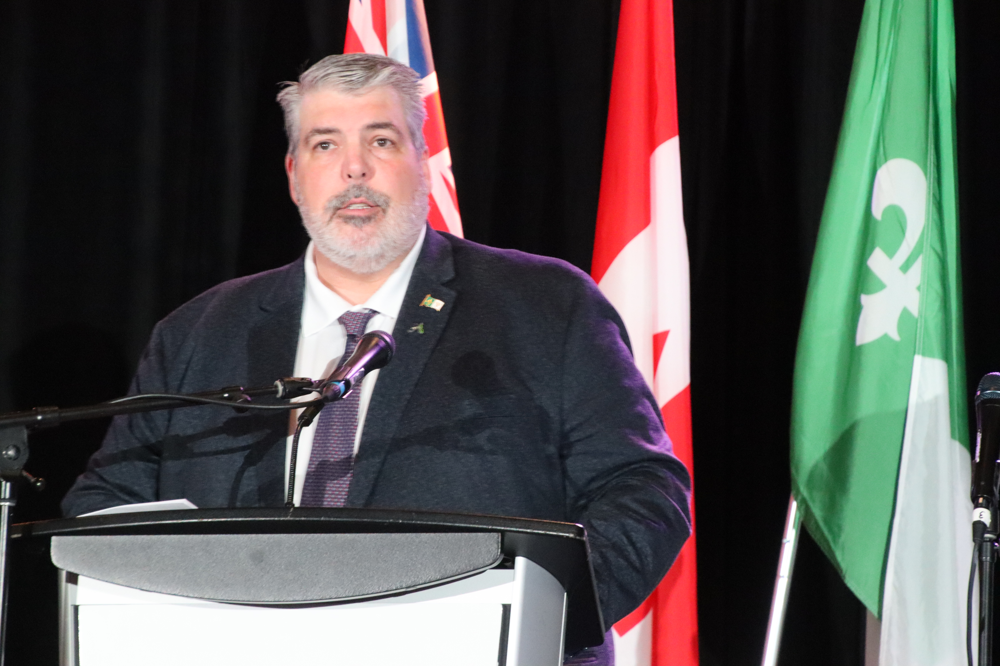
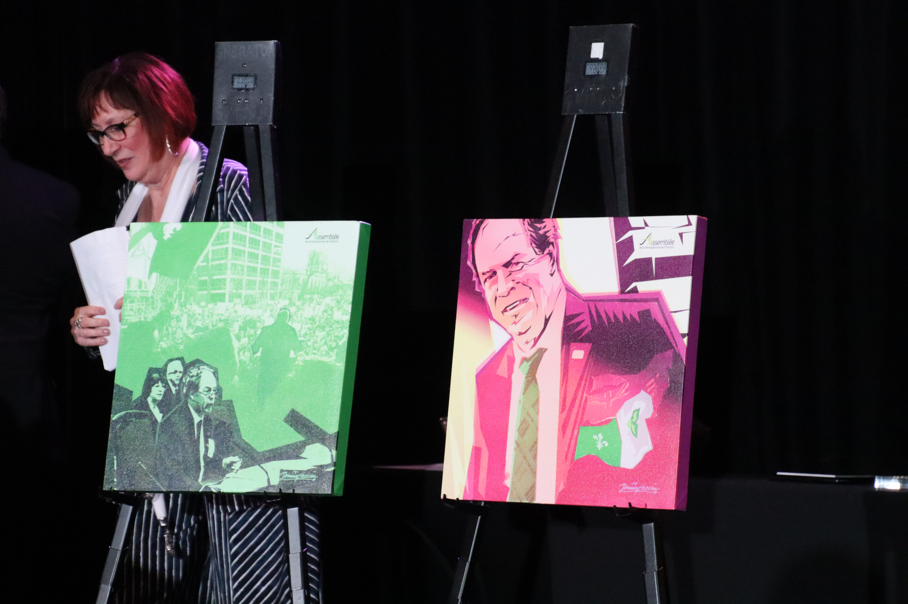
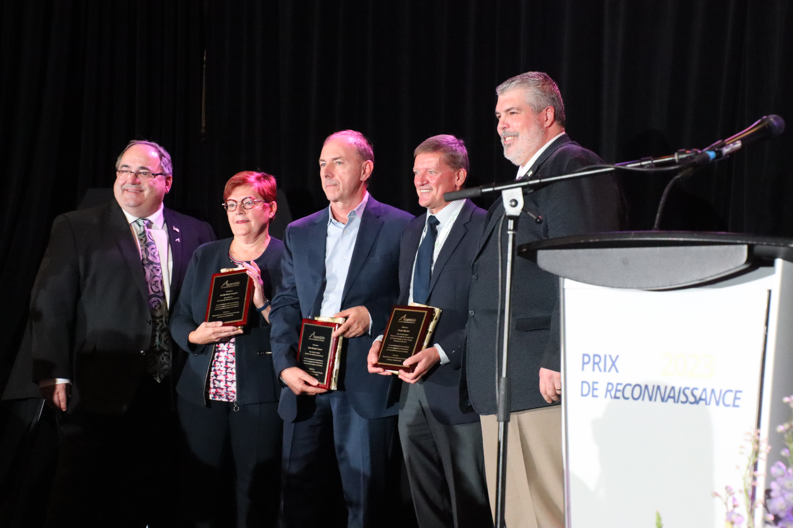
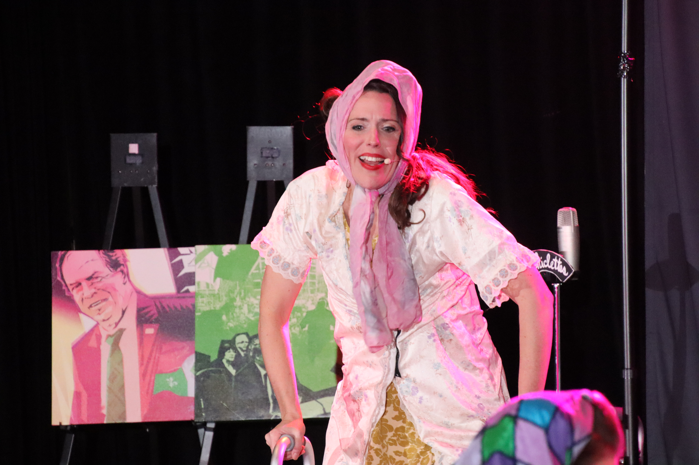

import {Carousel} from "react-bootstrap";

<Carousel>
<Carousel.Item>

</Carousel.Item>
<Carousel.Item>

</Carousel.Item>
<Carousel.Item>

</Carousel.Item>
<Carousel.Item>

</Carousel.Item>
<Carousel.Item>

</Carousel.Item>
<Carousel.Item>

</Carousel.Item>
<Carousel.Item>

</Carousel.Item>
<Carousel.Item>

</Carousel.Item>
<Carousel.Item>

</Carousel.Item>
<Carousel.Item>

</Carousel.Item>
<Carousel.Item>

</Carousel.Item>
</Carousel>

Le congrès annuel de l’AFO s’est tenu à Toronto du 27 au 29 octobre. Il a réuni plus de 300 personnes des quatre coins de la province au Sheraton Parkway Inn à Richmond Hill. Le lancement officiel du Congrès annuel de l'AFO 2023 a été marqué par des événements stimulants, notamment une conférence avec l'Honorable Lucie Moncion, des ateliers, une émission Sous les projecteurs (Parlons de l'importance de l'éducation comme moteur de la pérennité), un panel et des opportunités de réseautage avec Franconnexion.

Le congrès a permis aux nombreux intervenants des quatre coins de la province de partager leurs succès en plus de dialoguer afin de pouvoir établir des partenariats qui nous permettront de diversifier et d’enrichir la programmation qui est offerte à la communauté de Niagara. Les intervenants du Griffon ont également eut l’occasion de rencontrer divers bailleurs de fonds puisque le financement est fondamental au fonctionnement de notre organisme.

Le point culminant fut la remise du, « Prix de l’Horizon franco-ontarien » qui a été décerné à Sport Niagara qui a démontré un engagement remarquable en valorisant la communauté franco-ontarienne à l’échelle nationale. Le prix a été reçu par Susan Morin qui fut la chef de fil dans la réalisation des Jeux du Canada entièrement bilingue. En effet, tous les aspects des Jeux se réalisaient dans les 2 langues officielles du Canada. À partir de la cérémonie d’ouverture où Juliet Dunn a interprété, « Mon beau drapeau », aux spectacles journaliers sur la scène principale en français, à l’animation de la scène principale en français et en anglais, à la présence de commentateurs bilingues à chaque discipline sportive, il s’agissait des jeux du Canada les plus bilingues à jour. Pour cela nous devons remercier notre ambassadrice, Susan Morin. De plus, Le Griffon était fier de collaborer à la réalisation du Pavillon de la francophonie, un premier de ce genre aux Jeux du Canada. Il s’agissait d’un pavillon interactif qui offrait une animation en français pour la durée des Jeux.

Aucune rencontre canadienne française ne serait complète sans un party de cuisine. Ainsi, Les Chiclettes présentaient un spectacle à leur façon au gala de clôture du samedi.

Le Griffon œuvre à diversifier sa programmation d’année en année en multipliant ses contacts à Niagara et à l’étendue de l’Ontario français.
